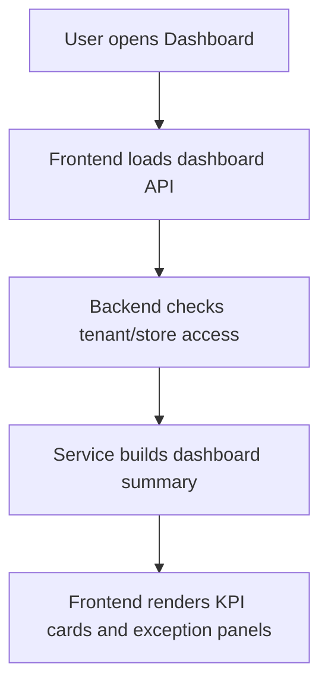
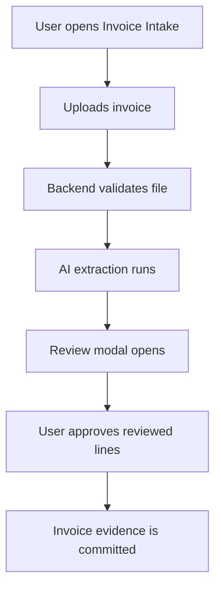
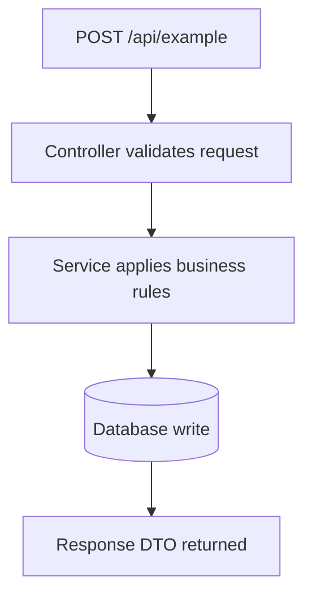

# Design Documentation Instructions

## Purpose

This file defines how Codex should create and maintain the project design document.

The project design document is the canonical app-design reference for this project. It is not a changelog, implementation log, release note, bugfix note, or task handoff.

The project design document should describe how the application is designed to work right now.

The document should be visual-first where helpful. It should use diagrams, screenshots, icons, vectors, annotated UI references, tables, and compact summaries so it does not become a wall of text.

Canonical document:

```txt
docs/PROJECT_DESIGN.md
```

Visual assets directory:

```txt
docs/design-assets/
docs/design-assets/screenshots/
docs/design-assets/icons/
docs/design-assets/diagrams/
```

---

## Trigger Phrase

When the user says:

```txt
update design documents
```

Codex must update or create:

```txt
docs/PROJECT_DESIGN.md
```

Codex must also ensure this instruction file is referenced from:

```txt
AGENTS.md
```

---

## Non-Goals

Do not use the project design document for:

* temporary task notes
* bugfix logs
* release notes
* sprint notes
* commit summaries
* test output dumps
* implementation diary entries
* speculative roadmap ideas unless clearly marked
* internal Codex reasoning
* copied source code blocks unless needed as short examples

Do not rewrite existing documentation systems unless the user explicitly asks.

---

## Source of Truth Rules

Codex must inspect the codebase before updating design documentation.

Preferred source order:

1. Backend controllers/routes
2. API DTOs/request/response models
3. Backend services and orchestration logic
4. Frontend routes/pages
5. Frontend API clients
6. Frontend stores/state modules
7. Integration clients/adapters
8. Existing screenshots or design assets
9. Existing docs
10. Tests

If docs disagree with code, document the current code behavior and mark the mismatch under `Documentation Drift`.

Do not invent behavior.

If behavior is unclear, write:

```txt
Needs verification
```

---

## Visual Documentation Doctrine

The project design document should use visual cues wherever they improve understanding.

Use visuals for:

* major user flows
* dashboard/screen layout explanations
* modal-heavy workflows
* review/approval flows
* upload/intake flows
* admin/configuration flows
* external integration/webhook flows
* complex API sequences
* state transitions
* permission boundaries
* data ownership/source-of-truth boundaries
* before/after UX comparisons, if relevant

Acceptable visual elements include:

* screenshots
* annotated screenshots
* Mermaid diagrams
* icons
* SVG/vector diagrams
* simple image references
* UI thumbnails
* flow cards
* compact tables
* endpoint maps
* route maps
* architecture maps

Do not make the document all text-heavy if a visual would communicate the design faster.

---

## Mandatory Visual Content Rule

The project design document must not only mention diagrams and screenshots. It must include actual visual content where possible.

Codex must add:

1. Mermaid code blocks for user flows.
2. Mermaid code blocks for endpoint flows.
3. Mermaid code blocks for architecture, data ownership, and integration boundaries where useful.
4. Screenshot image references for important screens where screenshots exist or can be safely generated.
5. Screenshot placeholders only when screenshots are unavailable or unsafe.

Do not leave the document with only text descriptions if Mermaid diagrams can be created from code inspection.

For every major user flow, include a Mermaid diagram.

For every non-trivial endpoint, include a Mermaid endpoint flow diagram. Related CRUD endpoints may be grouped when they share the same controller/service/database path, but the grouping must still include a real Mermaid block.

For every major screen, include either:

- an actual screenshot reference, or
- a `Screenshot needed:` placeholder explaining what screenshot should be captured.

Example Mermaid block:



Example screenshot reference:

```md

```

Example screenshot placeholder:

```md
> Screenshot needed: Dashboard overview with demo data and no private customer information.
```

---

## Screenshot Rules

Screenshots should be added where valuable, especially for:

* primary screens
* dashboards
* review modals
* upload flows
* configuration screens
* admin screens
* mobile/iPad layouts
* empty states
* error states
* success states
* destructive action confirmations
* complex table or card layouts

Screenshots must be stored under:

```txt
docs/design-assets/screenshots/
```

Use clear filenames:

```txt
docs/design-assets/screenshots/dashboard-overview.png
docs/design-assets/screenshots/invoice-intake-upload.png
docs/design-assets/screenshots/invoice-review-modal.png
docs/design-assets/screenshots/mobile-dashboard.png
docs/design-assets/screenshots/admin-config-screen.png
```

In markdown, reference screenshots like this:

```md

```

If screenshots are not available or cannot be generated, add a placeholder note:

```md
> Screenshot needed: dashboard overview.
```

Do not block the documentation update just because screenshots are missing.

---

## Screenshot Safety Rules

Before adding screenshots, verify that they do not expose:

* real customer data
* private user data
* emails
* phone numbers
* addresses
* API keys
* tokens
* credentials
* payment information
* private business data
* production secrets
* private messages
* internal-only vendor credentials

Use demo data, seeded data, local data, or redacted screenshots whenever possible.

If a screenshot contains sensitive data, do not include it. Instead, add:

```md
> Screenshot intentionally omitted because it may expose sensitive data.
```

---

## Icon / Vector / Visual Cue Rules

Use icons, vectors, and lightweight visual cues to improve readability.

Icons and vectors may be used for:

* user roles
* flow categories
* endpoint categories
* status states
* permissions
* integrations
* warnings
* success states
* review steps
* data ownership boundaries

Preferred storage:

```txt
docs/design-assets/icons/
docs/design-assets/diagrams/
```

Acceptable formats:

```txt
.svg
.png
.webp
```

Prefer SVG for simple icons and diagrams.

Use icons only when they clarify meaning. Do not add decorative clutter.

When using icons, keep them consistent and accessible:

* include meaningful alt text
* avoid color-only meaning
* avoid tiny unreadable icons
* use consistent naming
* prefer simple monochrome or low-noise visuals

Example markdown:

```md

```

If the project already has an icon system or design system, prefer existing assets instead of introducing a new style.

---

## Diagram Rules

Use Mermaid diagrams for both user flows and endpoint flows.

Use `flowchart TD` by default.

Example user-flow diagram:



Example endpoint diagram:



Every endpoint should have its own Mermaid flow diagram unless the endpoint is trivial. If skipped, explain why.

For complex flows, prefer both:

1. a Mermaid flow diagram
2. a screenshot or visual reference of the relevant UI

---

## Mermaid SVG Rendering Rule

Mermaid source blocks are useful, but they are not enough for all Markdown viewers.

When updating `docs/PROJECT_DESIGN.md`, Codex must:

1. Add Mermaid source blocks for user flows, endpoint flows, architecture diagrams, data ownership diagrams, and integration boundaries where useful.
2. Render Mermaid blocks into SVG files under `docs/design-assets/diagrams/` when Mermaid CLI is available.
3. Insert Markdown image references to the rendered SVGs immediately before the matching Mermaid source blocks.
4. Preserve Mermaid source blocks so diagrams remain editable.
5. Add or update a Diagram Catalog listing rendered SVGs and their related sections.
6. If rendering is unavailable, clearly report why and preserve the Mermaid source blocks.

If `scripts/render-design-mermaid.js` exists, prefer the project script:

```powershell
npm.cmd run docs:render-mermaid
```

Preferred command:

```bash
npx -y @mermaid-js/mermaid-cli@latest -i input.mmd -o output.svg
```

Windows PowerShell fallback:

```powershell
npx.cmd -y @mermaid-js/mermaid-cli@latest -i input.mmd -o output.svg
```

If Mermaid rendering fails because of syntax, fix only Mermaid syntax. Do not change application behavior.

---

## Required Project Design Document Structure

`docs/PROJECT_DESIGN.md` must use this structure:

```md
# Project Design Document

## 1. Purpose

## 2. Product Summary

## 3. Design Principles

## 4. UI/UX Doctrine

## 5. Visual Design Reference

## 6. User Roles and Permissions

## 7. Route and Screen Map

## 8. User Flow Catalog

## 9. API Surface Overview

## 10. Endpoint Design Details

## 11. Public-Facing API Contracts

## 12. JSON Data Structures

## 13. End-to-End Flow Diagrams

## 14. Endpoint Flow Diagrams

## 15. Screenshot Catalog

## 16. Icon / Visual Asset Catalog

## Diagram Catalog

## 17. Integration Boundaries

## 18. Data Ownership and Source-of-Truth Rules

## 19. Error Handling and Empty States

## 20. Security and Access Control Design

## 21. Feature Flags and Configuration

## 22. Known Design Constraints

## 23. Documentation Drift / Needs Verification

## 24. Last Updated
```

---

## Required Detail Level

The document must be useful to a new engineer trying to understand the full application design.

For every major user flow, include:

* flow name
* user goal
* entry screen
* frontend route
* key UI components
* relevant screenshot or screenshot placeholder
* backend endpoints used
* state transitions
* success state
* error/empty states
* Mermaid end-to-end flow diagram

For every major screen, include:

* route
* purpose
* primary user action
* secondary actions
* key components
* screenshot or screenshot placeholder
* empty state
* loading state
* error state
* mobile/iPad considerations

For every backend endpoint, include:

* method
* path
* purpose
* auth/role requirements if known
* request parameters
* request body example
* response body example
* validation rules
* side effects
* downstream services
* related frontend screens
* related screenshot if applicable
* Mermaid endpoint flow diagram

For every public-facing API, include:

* external consumer
* authentication method
* endpoint contract
* payload examples
* idempotency rules if applicable
* rate-limit or abuse assumptions if applicable
* error responses
* versioning assumptions
* visual flow diagram if applicable

For every JSON structure, include:

* object name
* purpose
* example JSON
* required fields
* optional fields
* source of truth
* producer
* consumers

---

## Categorization Rules

Partition the document by user flows first, then endpoints.

Preferred grouping:

```md
## User Flow Catalog

### Flow: Authentication

### Flow: Dashboard Review

### Flow: Upload / Intake

### Flow: Review / Approval

### Flow: Admin / Configuration

### Flow: Reporting / Export

### Flow: External Integration / Webhook
```

Then list endpoint details under the flow they support.

If one endpoint supports multiple flows, document it once and cross-reference it.

---

## UI/UX Doctrine Requirements

The UI/UX doctrine section must capture:

* navigation model
* page hierarchy
* modal vs page rules
* table usage rules
* mobile/iPad behavior
* empty states
* loading states
* error states
* review/approval interaction pattern
* destructive action pattern
* accessibility expectations
* visual density rules
* terminology and labeling rules
* consistency rules across modules
* where screenshots should be used
* where visual cues should be preferred over text

If the project already has a UI/UX doctrine, summarize it and link to the original file instead of duplicating everything.

For this project, preserve any current doctrine that review-heavy workflows should be minimal on the page and move complex follow-up actions into modal or guided flows where appropriate. Tables should not dominate operational pages unless the table itself is the primary job-to-be-done.

---

## Visual Design Reference Requirements

The `Visual Design Reference` section must capture:

* primary layout model
* navigation layout
* card patterns
* modal patterns
* table patterns
* mobile/iPad patterns
* icon usage
* screenshot references
* status badge patterns
* form patterns
* review/approval patterns
* empty/error/success visual patterns

Use screenshots and visual references where available.

Example:

```md
## 5. Visual Design Reference

### Dashboard Layout


**Purpose:** Shows the main operational summary and priority actions.

**Visual notes:**

- Primary KPIs appear first.
- Action cards appear before dense tables.
- Exceptions use status badges.
- Tables are secondary unless the page is table-first.
```

---

## Screenshot Catalog Requirements

The `Screenshot Catalog` section should list every screenshot used or needed.

Example:

```md
## 15. Screenshot Catalog

| Screenshot | File | Related Flow | Status |
|---|---|---|---|
| Dashboard overview | `design-assets/screenshots/dashboard-overview.png` | Dashboard Review | Present |
| Invoice upload | `design-assets/screenshots/invoice-intake-upload.png` | Upload / Intake | Needed |
| Review modal | `design-assets/screenshots/invoice-review-modal.png` | Review / Approval | Present |
```

If screenshots are needed but not available, mark them as `Needed`.

---

## Icon / Visual Asset Catalog Requirements

The `Icon / Visual Asset Catalog` section should list icons, vectors, or diagrams used or recommended.

Example:

```md
## 16. Icon / Visual Asset Catalog

| Asset | File | Purpose | Status |
|---|---|---|---|
| Review required icon | `design-assets/icons/review-required.svg` | Marks review-gated actions | Present |
| External integration icon | `design-assets/icons/external-integration.svg` | Marks webhook/provider flows | Needed |
| Data source boundary diagram | `design-assets/diagrams/data-source-boundary.svg` | Shows ownership boundaries | Needed |
```

---

## Safety and Accuracy Rules

Codex must not:

* invent endpoints
* invent request or response fields
* claim a feature exists if it is only planned
* change application behavior while updating docs
* refactor code unless explicitly asked
* remove existing docs
* overwrite unrelated docs
* include secrets, tokens, passwords, or private keys
* include private customer data
* include unredacted production screenshots
* include screenshots containing emails, phone numbers, addresses, payments, or private business records
* add decorative visuals that make the document harder to read

If example payloads require IDs, use fake placeholder IDs.

Example:

```json
{
  "storeId": "00000000-0000-0000-0000-000000000000"
}
```

---

## Update Procedure

When updating design documents:

1. Inspect repository structure.
2. Identify frontend framework and backend framework.
3. Find route definitions.
4. Find backend controllers.
5. Find API clients.
6. Find DTOs/request/response models.
7. Find feature flags/configuration.
8. Find existing design assets, screenshots, icons, and diagrams.
9. Find tests that clarify behavior.
10. Create design asset folders if missing:

    * `docs/design-assets/screenshots/`
    * `docs/design-assets/icons/`
    * `docs/design-assets/diagrams/`
11. Add screenshot references where useful.
12. Add screenshot placeholders where screenshots are needed but unavailable.
13. Add icons/vectors/diagram references where useful.
14. Render Mermaid diagrams to SVGs under `docs/design-assets/diagrams/` when Mermaid CLI is available.
15. Insert Markdown image references immediately before matching Mermaid source blocks.
16. Add or update the Diagram Catalog.
17. Update `docs/PROJECT_DESIGN.md`.
18. Add a `Last Updated` section with:

    * date
    * summary of inspected areas
    * known gaps
    * files referenced
    * screenshots/assets added or needed

---

## Required Final Response from Codex

After completing the update, Codex should respond with:

```md
## Design Documents Updated

Updated:

- `AGENTS.md`
- `docs/DESIGN_DOCUMENTATION_INSTRUCTIONS.md`
- `docs/PROJECT_DESIGN.md`
- `docs/design-assets/`

Summary:

- Added/confirmed the `update design documents` workflow.
- Created/updated the project design documentation instructions.
- Created/updated the project design document based on current code.
- Added visual documentation rules for screenshots, icons, vectors, and diagrams.
- Added screenshot placeholders where visual references are needed.

Validation:

- Confirmed existing documentation conventions were preserved.
- Confirmed no application behavior was changed.
- Confirmed screenshots/assets do not expose secrets or private data.

Known gaps:

- ...
```
