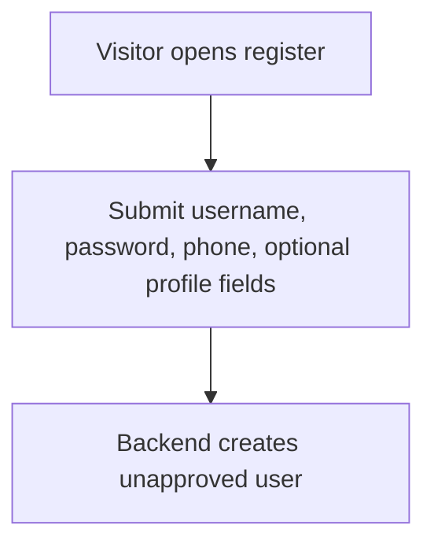
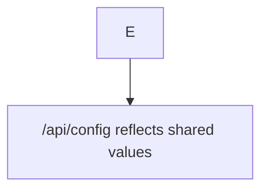

# Mermaid SVG Rendering Fix

## Problem

Mermaid code blocks inside Markdown only render as diagrams in viewers that support Mermaid. In raw Markdown or Markdown viewers without Mermaid support, they appear as code text.

## Fix Summary

This project fixed the visibility problem by keeping the fenced Mermaid source blocks in `docs/PROJECT_DESIGN.md`, rendering those blocks into standalone SVG files, storing the SVGs under `docs/design-assets/diagrams/`, and inserting normal Markdown image references immediately before the related Mermaid blocks.

That means:

- Mermaid-capable viewers can still render the source blocks.
- Raw Markdown and non-Mermaid viewers still show clickable/visible image assets.
- The diagram source remains editable in the document.
- The rendered SVGs are committed project assets.

The repo now contains a repeatable render script at `scripts/render-design-mermaid.js` and an npm script named `docs:render-mermaid`. The script does not add Mermaid CLI as a committed dependency; it invokes `@mermaid-js/mermaid-cli` through `npx` or `npx.cmd`.

## Files Changed

Verified changed or created files related to the Mermaid SVG rendering fix:

- `AGENTS.md`
- `docs/DESIGN_DOCUMENTATION_INSTRUCTIONS.md`
- `docs/PROJECT_DESIGN.md`
- `docs/design-assets/diagrams/.gitkeep`
- `docs/design-assets/diagrams/application-boundary-diagram.svg`
- `docs/design-assets/diagrams/application-boundary.svg`
- `docs/design-assets/diagrams/data-ownership-boundary.svg`
- `docs/design-assets/diagrams/data-ownership-flow.svg`
- `docs/design-assets/diagrams/endpoint-group-auth.svg`
- `docs/design-assets/diagrams/endpoint-group-catalog-categories-media.svg`
- `docs/design-assets/diagrams/endpoint-group-contact-notifications-make-and-print-agent.svg`
- `docs/design-assets/diagrams/endpoint-group-dashboard-configuration.svg`
- `docs/design-assets/diagrams/endpoint-group-orders-delivery.svg`
- `docs/design-assets/diagrams/endpoint-group-users-roles-and-store-credit.svg`
- `docs/design-assets/diagrams/flow-admin-configuration.svg`
- `docs/design-assets/diagrams/flow-authentication-and-approval.svg`
- `docs/design-assets/diagrams/flow-browse-cart-and-checkout.svg`
- `docs/design-assets/diagrams/flow-delivery-route.svg`
- `docs/design-assets/diagrams/flow-external-integration-webhook-and-print-agent.svg`
- `docs/design-assets/diagrams/flow-product-create-edit.svg`
- `docs/design-assets/diagrams/flow-product-media-upload-import.svg`
- `docs/design-assets/diagrams/flow-reporting-export.svg`
- `docs/design-assets/diagrams/flow-staff-order-operations.svg`
- `docs/design-assets/diagrams/role-gated-navigation.svg`
- `docs/design-assets/diagrams/shared-api-request-pipeline.svg`
- `docs/design-assets/diagrams/manifest.json`
- `scripts/render-design-mermaid.js`
- `package.json`

Related visual documentation files created in the same design-documentation update:

- `docs/design-assets/screenshots/.gitkeep`
- `docs/design-assets/screenshots/login-screen.png`
- `docs/design-assets/screenshots/register-screen.png`
- `docs/design-assets/icons/.gitkeep`
- `docs/design-assets/icons/external-integration.svg`
- `docs/design-assets/icons/review-required.svg`

New file documenting the fix:

- `docs/MERMAID_SVG_RENDERING_FIX.md`

## Commands Used

The rendering workflow is now committed as `scripts/render-design-mermaid.js`.

Run the repeatable workflow on Windows PowerShell with:

```powershell
npm.cmd run docs:render-mermaid
```

The bare `npm` command may be blocked by PowerShell execution policy because it resolves to `npm.ps1`.

The npm script is:

```json
{
  "docs:render-mermaid": "node scripts/render-design-mermaid.js"
}
```

The script extracts Mermaid blocks, writes temporary `.mmd` files, renders SVGs, inserts missing image references, writes `docs/design-assets/diagrams/manifest.json`, and removes `.tmp-mermaid-render/` unless `KEEP_MERMAID_TMP` is set.

The following lower-level commands document the workflow used and verified for this project.

Check whether Mermaid CLI is available through `npx.cmd`:

```powershell
npx.cmd -y @mermaid-js/mermaid-cli@latest --version
```

Observed CLI version during the fix:

```txt
11.15.0
```

Extract Mermaid code blocks from `docs/PROJECT_DESIGN.md` into temporary `.mmd` files:

```powershell
New-Item -ItemType Directory -Force .tmp-mermaid-render
```

Extraction is performed by `scripts/render-design-mermaid.js`, which:

1. Read `docs/PROJECT_DESIGN.md`.
2. Matched fenced blocks using a regular expression for ```` ```mermaid ... ``` ````.
3. Wrote each block body into `.tmp-mermaid-render/*.mmd`.
4. Uses an existing nearby SVG image reference when present so filenames stay stable.
5. Falls back to readable heading-based filenames when a Mermaid block does not already have an SVG reference.

Render each extracted `.mmd` file to an SVG:

```powershell
npx.cmd -y @mermaid-js/mermaid-cli@latest -i .tmp-mermaid-render\<name>.mmd -o docs\design-assets\diagrams\<name>.svg
```

Remove the temporary render directory after successful output:

```powershell
Remove-Item -Recurse -Force .tmp-mermaid-render
```

Validate Mermaid block count:

```powershell
$count = (Select-String -Path docs\PROJECT_DESIGN.md -Pattern '```mermaid').Count
"Mermaid blocks in PROJECT_DESIGN.md: $count"
```

Validate referenced SVG paths:

```powershell
$refs = rg -o "design-assets/diagrams/[^)]+\.svg" docs\PROJECT_DESIGN.md |
  ForEach-Object { ($_ -split ':')[-1] } |
  Where-Object { $_ -notmatch '\*' } |
  Sort-Object -Unique

foreach ($r in $refs) {
  $p = Join-Path 'docs' ($r -replace '/', '\')
  if (Test-Path -LiteralPath $p) { "OK $r" } else { "MISSING $r" }
}
```

Search for committed Mermaid tooling:

```powershell
rg -n "mermaid|mmdc|@mermaid-js/mermaid-cli" package.json package-lock.json backend\package.json backend\package-lock.json web\package.json web\package-lock.json
```

Current result: no committed Mermaid CLI package dependency was found. A committed render script exists at `scripts/render-design-mermaid.js`.

## Windows Notes

On this Windows environment, the PowerShell `npx.ps1` shim was blocked by execution policy. The working command used the Windows command shim instead:

```powershell
npx.cmd -y @mermaid-js/mermaid-cli@latest --version
npx.cmd -y @mermaid-js/mermaid-cli@latest -i .tmp-mermaid-render\<name>.mmd -o docs\design-assets\diagrams\<name>.svg
```

Use `npx.cmd`, not bare `npx`, when PowerShell blocks script shims.

## Mermaid Extraction Strategy

The extraction strategy was:

1. Read `docs/PROJECT_DESIGN.md`.
2. Find each fenced Mermaid block:

   ````md
   ```mermaid
   flowchart TD
       A[Start] --> B[End]
   ```
   ````

3. Write the contents inside each fence to a temporary `.mmd` file.
4. Preserve the original Mermaid blocks in `docs/PROJECT_DESIGN.md`.
5. Render the temporary `.mmd` files into permanent SVG assets.

Temporary extraction directory:

```txt
.tmp-mermaid-render/
```

The temporary directory was removed after rendering.

Manifest behavior:

- `scripts/render-design-mermaid.js` writes `docs/design-assets/diagrams/manifest.json`.
- The manifest lists the source Markdown file, output directory, renderer, headings, temporary `.mmd` source names, SVG paths, render status, and exit codes.
- `.tmp-mermaid-render/` remains temporary and is removed after the run.

## SVG Output Strategy

Rendered SVG files were saved under:

```txt
docs/design-assets/diagrams/
```

Naming strategy:

- Major user-flow diagrams use `flow-*.svg`.
- Endpoint-group diagrams use `endpoint-group-*.svg`.
- System/boundary diagrams use descriptive names such as `application-boundary.svg`, `role-gated-navigation.svg`, `shared-api-request-pipeline.svg`, and `data-ownership-flow.svg`.

Examples:

```txt
docs/design-assets/diagrams/flow-authentication-and-approval.svg
docs/design-assets/diagrams/flow-product-media-upload-import.svg
docs/design-assets/diagrams/endpoint-group-auth.svg
docs/design-assets/diagrams/shared-api-request-pipeline.svg
```

Current verified counts:

- `docs/PROJECT_DESIGN.md` contains 20 Mermaid source blocks.
- `docs/design-assets/diagrams/` contains 21 SVG files.
- `docs/PROJECT_DESIGN.md` references 21 diagram SVG paths.

The extra SVG reference count includes `data-ownership-boundary.svg`, an existing manually created visual diagram that is not a rendered Mermaid block.

## Markdown Reference Strategy

The generated SVGs were inserted into `docs/PROJECT_DESIGN.md` as standard Markdown image references immediately before the corresponding Mermaid source block.

Pattern:

````md



````

This preserves editable Mermaid source while giving non-Mermaid Markdown viewers a normal image asset to display or link.

The visual asset catalog in `docs/PROJECT_DESIGN.md` was also updated to list the rendered diagram asset families:

- `design-assets/diagrams/flow-*.svg`
- `design-assets/diagrams/endpoint-group-*.svg`
- `design-assets/diagrams/application-boundary.svg`
- `design-assets/diagrams/shared-api-request-pipeline.svg`
- `design-assets/diagrams/data-ownership-flow.svg`

## Syntax Issues Found

One Mermaid syntax issue was found while rendering:

Original problematic line:

```mermaid
flowchart TD
    E --> F[/api/config reflects shared values]
```

Mermaid CLI treated the leading slash in the bracket label as invalid syntax in that context.

Fixed line:



The fixed version quotes the node label so Mermaid parses the slash-containing text as a label.

## Documentation Instruction Updates

`AGENTS.md` was updated to make `docs/DESIGN_DOCUMENTATION_INSTRUCTIONS.md` and `docs/PROJECT_DESIGN.md` the design-documentation workflow targets.

`docs/DESIGN_DOCUMENTATION_INSTRUCTIONS.md` was updated to require actual visual content for design documentation, including:

- Mermaid code blocks for user flows.
- Mermaid code blocks for endpoint flows.
- Mermaid code blocks for architecture, data ownership, and integration boundaries where useful.
- Screenshot references or explicit screenshot placeholders.
- Visual assets organized under `docs/design-assets/`.

Needs verification: neither `AGENTS.md` nor `docs/DESIGN_DOCUMENTATION_INSTRUCTIONS.md` currently requires rendered SVG copies of Mermaid diagrams. The rendered-SVG approach is documented in this file as the reusable fix for Markdown viewers without Mermaid support.

## Repeatable Recipe

1. Keep the Mermaid source blocks in the Markdown file.

   Do not remove editable source diagrams unless the project intentionally wants image-only documentation.

2. Create a diagram output directory.

   ```powershell
   New-Item -ItemType Directory -Force docs\design-assets\diagrams
   ```

3. Extract each Mermaid fenced block into a temporary `.mmd` file.

   Suggested temporary location:

   ```txt
   .tmp-mermaid-render/
   ```

4. Name each output file based on the section or flow name.

   Examples:

   ```txt
   flow-authentication-and-approval.svg
   endpoint-group-auth.svg
   shared-api-request-pipeline.svg
   ```

5. Render each `.mmd` file with Mermaid CLI.

   On Windows PowerShell:

   ```powershell
   npx.cmd -y @mermaid-js/mermaid-cli@latest -i .tmp-mermaid-render\flow-authentication-and-approval.mmd -o docs\design-assets\diagrams\flow-authentication-and-approval.svg
   ```

   On shells where `npx` is not blocked:

   ```bash
   npx -y @mermaid-js/mermaid-cli@latest -i .tmp-mermaid-render/flow-authentication-and-approval.mmd -o docs/design-assets/diagrams/flow-authentication-and-approval.svg
   ```

6. Insert a Markdown image reference immediately before the corresponding Mermaid block.

   ```md
   
   ```

7. Fix Mermaid parse errors as they appear.

   A common fix is to quote labels containing slashes, punctuation, or other parser-sensitive characters:

   ```mermaid
   flowchart TD
       A --> B["/api/config reflects shared values"]
   ```

8. Validate that every referenced SVG exists.

   ```powershell
   $refs = rg -o "design-assets/diagrams/[^)]+\.svg" docs\PROJECT_DESIGN.md |
     ForEach-Object { ($_ -split ':')[-1] } |
     Where-Object { $_ -notmatch '\*' } |
     Sort-Object -Unique

   foreach ($r in $refs) {
     $p = Join-Path 'docs' ($r -replace '/', '\')
     if (Test-Path -LiteralPath $p) { "OK $r" } else { "MISSING $r" }
   }
   ```

9. Validate that Mermaid source blocks are still present.

   ```powershell
   Select-String -Path docs\PROJECT_DESIGN.md -Pattern '```mermaid'
   ```

10. Remove temporary files after rendering.

    ```powershell
    Remove-Item -Recurse -Force .tmp-mermaid-render
    ```

11. Commit the Markdown file and generated SVG assets.

## Reusable Codex Prompt

```md
Identify all Mermaid code blocks in the project design Markdown file and render them into visible SVG assets for Markdown viewers that do not support Mermaid.

Requirements:

- Do not remove the original Mermaid source blocks.
- Extract each fenced `mermaid` block into a temporary `.mmd` file.
- Render each `.mmd` file to an SVG using Mermaid CLI.
- On Windows, use `npx.cmd -y @mermaid-js/mermaid-cli@latest` if `npx.ps1` is blocked by execution policy.
- Save rendered SVGs under `docs/design-assets/diagrams/`.
- Name SVGs from the section or flow names, such as `flow-authentication.svg`, `endpoint-group-orders.svg`, or `shared-api-request-pipeline.svg`.
- Insert a Markdown image reference immediately before each related Mermaid block.
- Preserve existing documentation structure and design-documentation workflow.
- Fix Mermaid syntax errors only as needed for rendering, and document every syntax fix.
- Do not change application behavior.
- Do not include secrets, credentials, private data, or production screenshots.
- Validate that every referenced SVG exists and that Mermaid source blocks are still present.

After finishing, create or update a short implementation note explaining the commands used, Windows notes, output paths, syntax fixes, and validation steps.
```

## Validation

Use these checks to verify the fix.

### Mermaid SVG files exist

```powershell
Get-ChildItem docs\design-assets\diagrams -Filter *.svg | Sort-Object Name | Select-Object -ExpandProperty Name
```

Current verified result:

```txt
application-boundary.svg
application-boundary-diagram.svg
data-ownership-boundary.svg
data-ownership-flow.svg
endpoint-group-auth.svg
endpoint-group-catalog-categories-media.svg
endpoint-group-contact-notifications-make-and-print-agent.svg
endpoint-group-dashboard-configuration.svg
endpoint-group-orders-delivery.svg
endpoint-group-users-roles-and-store-credit.svg
flow-admin-configuration.svg
flow-authentication-and-approval.svg
flow-browse-cart-and-checkout.svg
flow-delivery-route.svg
flow-external-integration-webhook-and-print-agent.svg
flow-product-create-edit.svg
flow-product-media-upload-import.svg
flow-reporting-export.svg
flow-staff-order-operations.svg
role-gated-navigation.svg
shared-api-request-pipeline.svg
```

### `PROJECT_DESIGN.md` references the SVGs

```powershell
rg -n "design-assets/diagrams" docs\PROJECT_DESIGN.md
```

Current verified result:

- 21 diagram SVG references are present in `docs/PROJECT_DESIGN.md`.
- All referenced diagram SVG paths resolve to files under `docs/design-assets/diagrams/`.

### Raw Markdown now shows image links

Open `docs/PROJECT_DESIGN.md` in a raw Markdown viewer. The rendered diagrams appear as standard Markdown image references such as:

```md

```

Even if the viewer does not render Mermaid, it can display or link the SVG asset.

### Mermaid source blocks are still preserved

```powershell
$count = (Select-String -Path docs\PROJECT_DESIGN.md -Pattern '```mermaid').Count
"Mermaid blocks in PROJECT_DESIGN.md: $count"
```

Current verified result:

```txt
Mermaid blocks in PROJECT_DESIGN.md: 20
```

### Mermaid CLI dependency status

```powershell
rg -n "mermaid|mmdc|@mermaid-js/mermaid-cli" package.json package-lock.json backend\package.json backend\package-lock.json web\package.json web\package-lock.json
```

Current verified result:

```txt
No committed Mermaid CLI package dependency found. Rendering is handled by `scripts/render-design-mermaid.js` through one-off `npx` / `npx.cmd` execution.
```
