# Project Design Document

## 1. Purpose

This document describes the current application design for Smoke Station.

It is intended to help engineers, maintainers, Codex, and future contributors understand the product flows, UI/UX doctrine, API surface, endpoint behavior, JSON structures, integration boundaries, visual design patterns, and screen-level user experience.

This document is separate from changelogs, implementation notes, release notes, and task-specific documentation.

---

## 2. Product Summary

Smoke Station is a role-gated e-commerce and operations application with:

- React/Vite frontend in `web/`
- Express/TypeScript backend in `backend/`
- PostgreSQL database via Prisma
- Docker-based local development stack
- Product catalog, cart, checkout, pickup/delivery workflow, staff order board, delivery driver board, admin settings, user approval, store credit, contact messages, notifications, product media uploads, and print job polling

Needs verification: production branding, target customer persona, and final copy doctrine.

---

## 3. Design Principles

- Code is the source of truth when docs drift.
- Authentication and role checks gate nearly every app screen after `/login` and `/register`.
- Operational pages should be action-first: staff can triage orders, registrations, messages, and delivery routes without digging through long text.
- Customer-facing checkout should preserve recovery paths, including cart restoration when an external payment order is cancelled.
- Product media handling must preserve the current contract: omit `image` unless it is a real string URL, and keep media uploads limited to supported image/video types.
- Privacy matters: order and print payloads should avoid exposing payment handles unless explicitly required.

---

## 4. UI/UX Doctrine

- Navigation model: global `Navbar`, announcement banner, pickup notice, notification surface, and route-specific main content.
- Page hierarchy: authenticated home is `/`; catalog and checkout flows are customer-first; dashboard/order surfaces are staff/admin-first.
- Modal vs page rules: product details can open in a modal with a full-page escape hatch; checkout payment confirmation uses a guided modal; destructive actions use confirmation modals.
- Table usage rules: management sections may use dense lists/tables when the table is the job-to-be-done, but order and delivery work uses boards/cards.
- Mobile/iPad behavior: responsive CSS exists, but full mobile/iPad visual verification is needed.
- Empty states: shared `EmptyState` and smaller operational empty states are used for product loading, catalog gaps, and delivery boards.
- Loading states: protected routes show a lightweight loading placeholder; pages use inline loading text or empty-state variants.
- Error states: API errors are surfaced through notifications and local form validation.
- Review/approval pattern: pending registrations, rejected users, messages, order status changes, and route edits are staff review workflows.
- Destructive action pattern: confirmation modals are used for deletes/unrejects and similar irreversible actions.
- Accessibility expectations: icons from `lucide-react` are used widely; deeper keyboard and screen-reader verification is needed.
- Visual density rules: catalog pages balance product cards/lists with category navigation; operations pages use cards, badges, tabs, and compact controls.
- Terminology and labeling: order statuses map internal enum values to staff-facing labels such as `Prep Order`, `Ready for Delivery`, and `In Delivery`.
- Visual cue usage: icons clarify statuses, actions, contact details, and delivery states.
- Screenshot usage: screenshots should be added for primary screens once safe seeded/demo data is available.

---

## 5. Visual Design Reference

### Primary Layout

> Screenshot needed: primary authenticated app layout.

The app shell comes from `web/src/App.jsx`: `AnnouncementBanner`, `OrderPickupNotice`, `Navbar`, `Notification`, and a main content area. `/orders` and `/delivery-dashboard` use a full-width layout; other screens use a constrained container.

### Authentication Screens

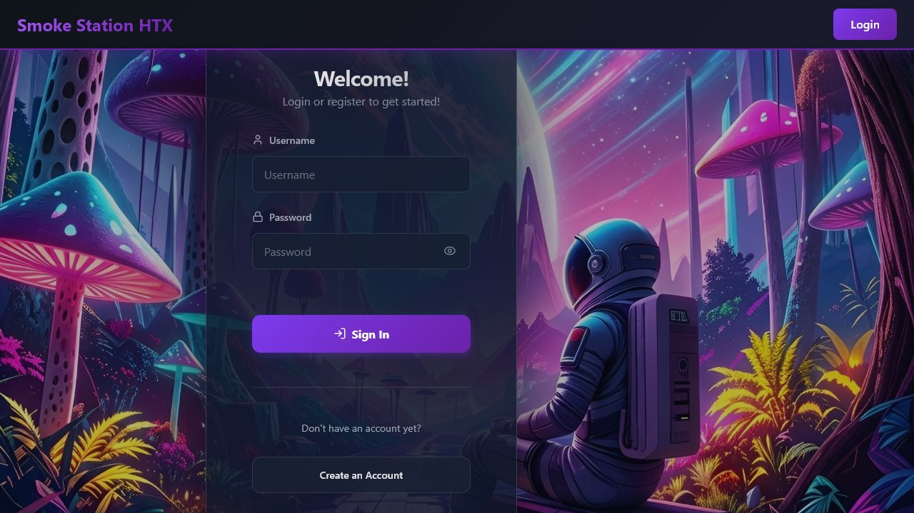

**Purpose:** Public sign-in screen with brand-forward hero art and no prefilled private data.

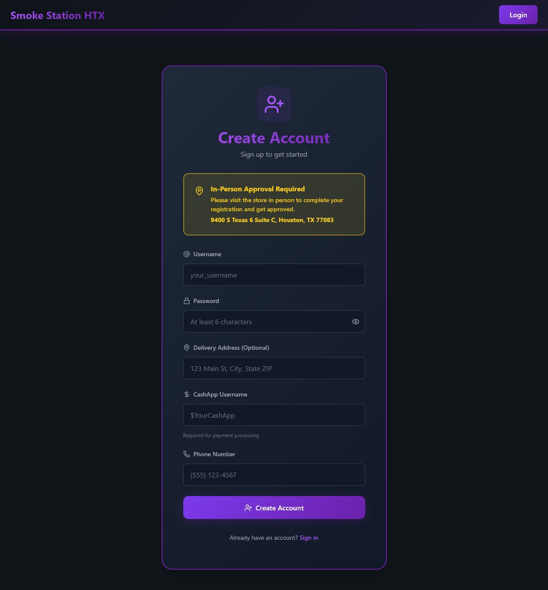

**Purpose:** Public registration screen showing the account request form and in-person approval notice.

### Landing / Catalog Visuals

Existing public assets:

- `web/public/images/smokestationtitle.png`
- `web/public/images/storefront-1x.webp`
- `web/public/images/storefront-2x.webp`
- `web/public/images/login-hero-bg.jpg`
- `web/public/images/space_traveler_3d.png`

> Screenshot needed: landing page hero and featured product grid.

### Operational Visual Cues


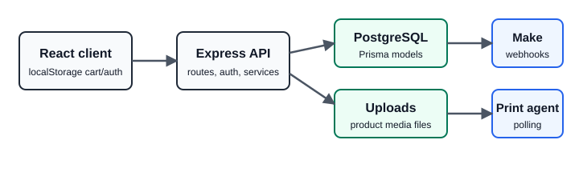

### Application Boundary Diagram



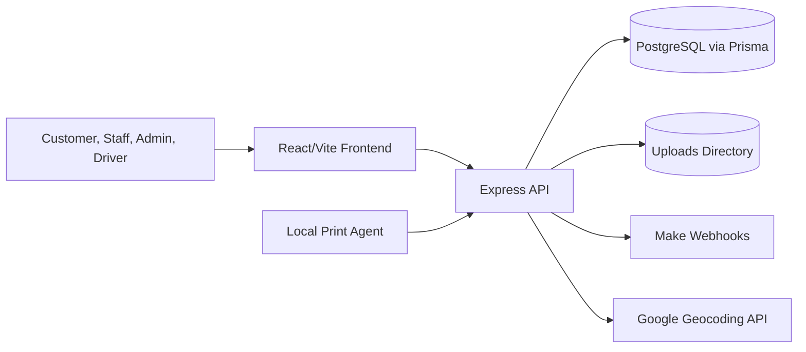
```mermaid
flowchart LR
    U[Customer, Staff, Admin, Driver] --> FE[React/Vite Frontend]
    FE --> API[Express API]
    API --> DB[(PostgreSQL via Prisma)]
    API --> UP[(Uploads Directory)]
    API --> MK[Make Webhooks]
    PA[Local Print Agent] --> API
    API --> GG[Google Geocoding API]
```

---

## 6. User Roles and Permissions

Roles are defined in `backend/src/constants/roles.ts` and mirrored in frontend role helpers.

| Role | Current design purpose | Notes |
|---|---|---|
| `GUEST` | Guest sentinel/fallback user state | Protected routes redirect guests to `/login`. |
| `CUSTOMER` | Browse products, cart, checkout, profile, own orders, help | Login requires approval. |
| `VIP` | Can see VIP-only products when also authenticated | Current route guards do not admit `VIP` by itself; VIP access is designed as an additional role on an otherwise route-authorized user. |
| `EMPLOYEE` | Staff order modification and staff notification counts | Can access `/orders`; endpoint permissions vary. |
| `MANAGEMENT` | Dashboard, product management, users, settings subset, order work | Includes many admin-adjacent workflows. |
| `ADMIN` | Full administrative access, destructive deletes, history/settings | Required for several settings and delete endpoints. |
| `DELIVERY_DRIVER` | Delivery board and limited delivery status transitions | Can mark delivery orders as `DELIVERED`; cannot broadly manage orders. |

---

## 7. Route and Screen Map

| Route | Screen/Page | Purpose | Primary User Flow | Screenshot | Notes |
|---|---|---|---|---|---|
| `/login` | `LoginPage` | Authenticate approved users | Authentication | Present: `design-assets/screenshots/login-screen.png` | Public route. |
| `/register` | `RegisterPage` | Submit pending account registration | Authentication | Present: `design-assets/screenshots/register-screen.png` | Loads shared config on register. |
| `/` | `LandingPage` | Authenticated home, search, featured products | Browse / Search | Needed | Protected for customer/staff roles. |
| `/products` | `ProductsPage` | Browse product catalog | Browse / Cart | Needed | Supports grid/list and product modal. |
| `/products/:id` | `ProductItemPage` | Full product detail page | Browse / Cart | Needed | Product modal can navigate here. |
| `/cart` | `CartPage` | Review cart | Cart / Checkout | Needed | Cart persists in localStorage. |
| `/checkout` | `CheckoutPage` | Choose pickup/delivery and payment | Checkout | Needed | Delivery eligibility precheck. |
| `/order-success` | `OrderSuccessPage` | Completion state after checkout | Checkout | Needed | Clears/settles order success flow. |
| `/profile` | `ProfilePage` | Manage own profile | Account | Needed | Uses user update endpoint. |
| `/orders` | `OrdersPage` | Customer order list or staff order board | Order Operations | Needed | Full-width layout; query status filters. |
| `/manage-products` | `ProductsPage mode="manage"` | Product/category/media management | Product Management | Needed | Management/Admin. |
| `/dashboard` | `DashboardPage` | Admin/management console | Admin / Configuration | Needed | Tabbed sections. |
| `/store-credit` | `StoreCreditPage` | Manage user credit | Store Credit | Needed | Management/Admin. |
| `/order-history` | `OrderHistoryPage` | Delivered order history | Reporting / History | Needed | Admin only. |
| `/delivery-dashboard` | `DeliveryDriverDashboard` | Route selection and delivery completion | Delivery | Needed | Full-width layout. |
| `/help` | `HelpPage` | Contact/support form | Support | Needed | Authenticated users. |

---

## 8. User Flow Catalog

### Flow: Authentication and Approval

**User goal:** Register, wait for approval, then sign in.  
**Entry screen:** `/register` or `/login`  
**Frontend route:** `/register`, `/login`, protected route redirects  
**Key UI components:** `RegisterPage`, `LoginPage`, `ProtectedRoute`, dashboard pending registration section  
**Relevant screenshot:** `design-assets/screenshots/login-screen.png`, `design-assets/screenshots/register-screen.png`  
**Backend endpoints:** `POST /api/auth/register`, `POST /api/auth/login`, `GET /api/auth/profile`, `GET /api/users/pending`, `POST /api/users/:id/approve`, `POST /api/users/:id/reject`  
**State transitions:** registered user starts unapproved; management/admin approves or rejects; approved user can log in.  
**Success state:** token and user data stored client-side after login.  
**Error/empty states:** validation errors, login denied for unapproved/rejected users, no pending registrations.


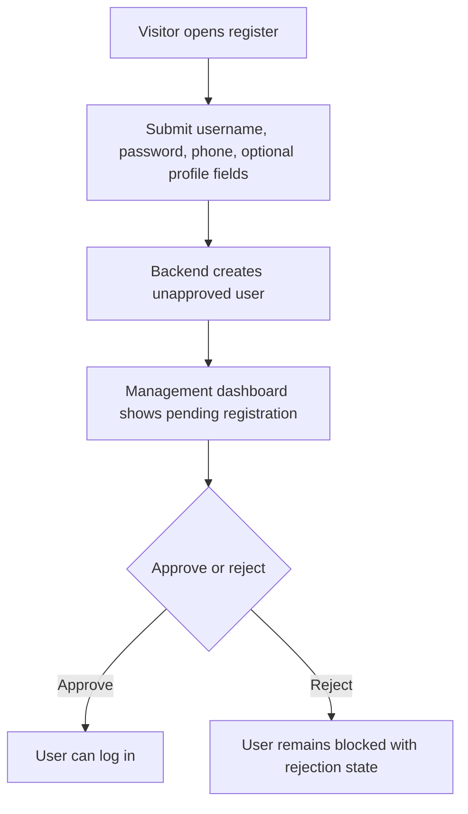
```mermaid
flowchart TD
    A[Visitor opens register] --> B[Submit username, password, phone, optional profile fields]
    B --> C[Backend creates unapproved user]
    C --> D[Management dashboard shows pending registration]
    D --> E{Approve or reject}
    E -->|Approve| F[User can log in]
    E -->|Reject| G[User remains blocked with rejection state]
```

### Flow: Browse, Cart, and Checkout

**User goal:** Find products, add to cart, choose pickup/delivery, and place an order.  
**Entry screen:** `/`, `/products`  
**Frontend route:** `/`, `/products`, `/products/:id`, `/cart`, `/checkout`, `/order-success`  
**Key UI components:** `LandingPage`, `ProductsGrid`, `ProductItemModal`, `CartPage`, `CheckoutPage`, `SendPaymentModal`  
**Relevant screenshot:** Needed  
**Backend endpoints:** `GET /api/config`, `GET /api/products`, `GET /api/categories`, `POST /api/orders/delivery-eligibility`, `POST /api/orders`  
**State transitions:** cart stored in `localStorage['cartData']`; checkout creates order; external payment can require modal follow-up.  
**Success state:** order created and success route shown.  
**Error/empty states:** empty catalog/cart, invalid address, delivery disabled/minimum blocked, insufficient credit.



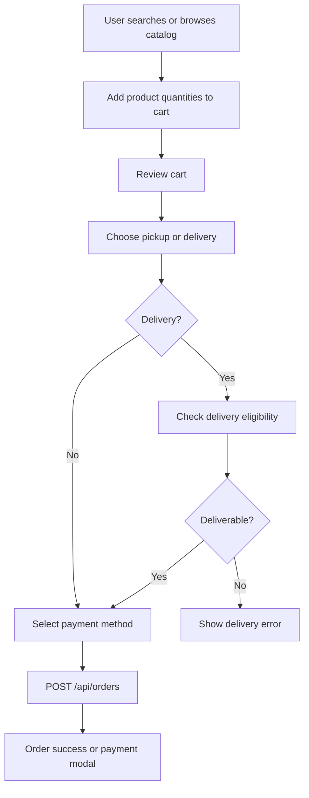
```mermaid
flowchart TD
    A[User searches or browses catalog] --> B[Add product quantities to cart]
    B --> C[Review cart]
    C --> D[Choose pickup or delivery]
    D --> E{Delivery?}
    E -->|Yes| F[Check delivery eligibility]
    E -->|No| G[Select payment method]
    F --> H{Deliverable?}
    H -->|No| I[Show delivery error]
    H -->|Yes| G
    G --> J[POST /api/orders]
    J --> K[Order success or payment modal]
```

### Flow: Staff Order Operations

**User goal:** Review orders, update status, edit items, print receipts, or remove invalid orders.  
**Entry screen:** `/orders`  
**Frontend route:** `/orders?status=...`  
**Key UI components:** `OrdersPage`, `OrderDetailPanel`, `CustomerOrderList`, status filters, confirmation dialogs  
**Relevant screenshot:** Needed  
**Backend endpoints:** `GET /api/orders`, `PATCH /api/orders/:id/status`, `POST /api/orders/:id/items`, `PATCH /api/orders/:id/items/:itemId/void`, `DELETE /api/orders/:id/items/:itemId`, `POST /api/orders/:id/print`, `DELETE /api/orders/:id`  
**State transitions:** `PENDING` -> `APPROVED` / `NOT_FULFILLING`; delivery/pickup statuses progress to terminal statuses.  
**Success state:** board refreshes with updated status and optional print job.  
**Error/empty states:** no orders in selected statuses, invalid order/item ID, insufficient permission.



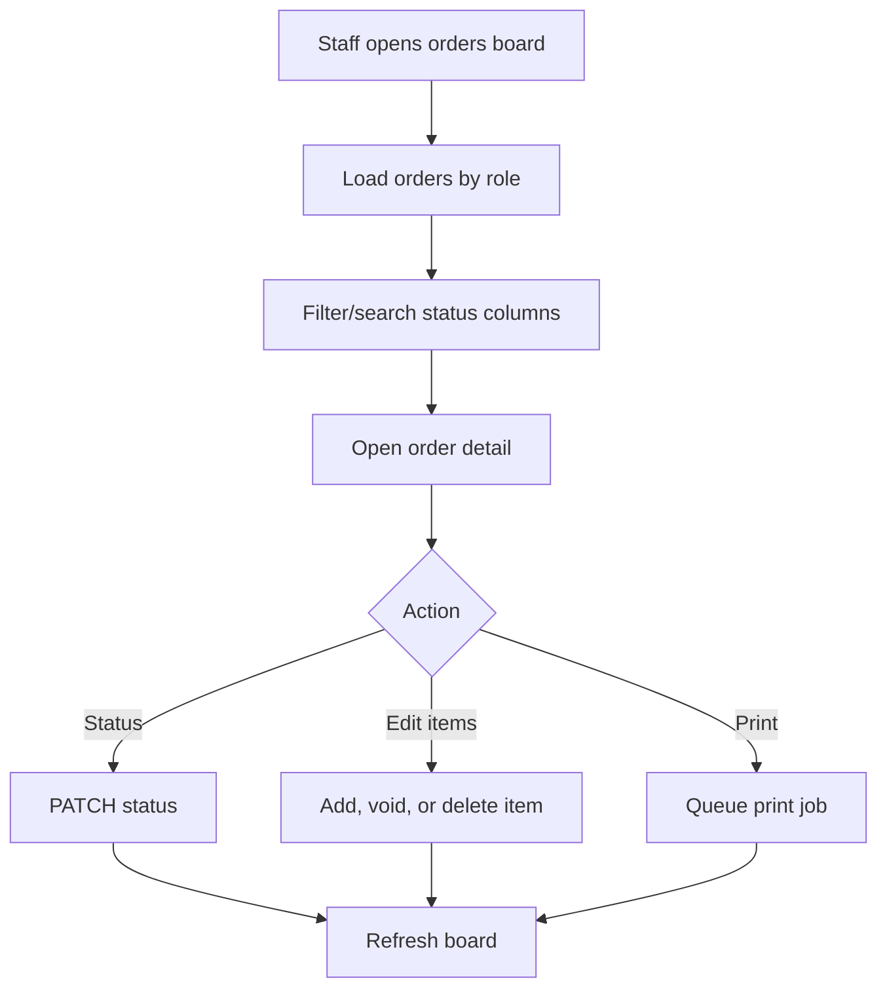
```mermaid
flowchart TD
    A[Staff opens orders board] --> B[Load orders by role]
    B --> C[Filter/search status columns]
    C --> D[Open order detail]
    D --> E{Action}
    E -->|Status| F[PATCH status]
    E -->|Edit items| G[Add, void, or delete item]
    E -->|Print| H[Queue print job]
    F --> I[Refresh board]
    G --> I
    H --> I
```

### Flow: Product Media Upload / Import

**User goal:** Add or import safe product media for the product catalog.  
**Entry screen:** Product management panel.  
**Frontend route:** `/manage-products`  
**Key UI components:** `ManageProductsPanel`, `MediaLibraryModal`, `ProductMediaModal`, `ImageCropModal`, CSV/import controls  
**Relevant screenshot:** Needed  
**Backend endpoints:** `POST /api/upload`, `POST /api/upload/multiple`, `POST /api/upload/import-zip`, `GET /api/upload`, `DELETE /api/upload/:filename`  
**State transitions:** selected local files become backend upload files; image files are converted to WebP; product payloads reference returned URLs.  
**Success state:** uploaded media appears in the media library and can be attached to products.  
**Error/empty states:** unsupported file type, missing file, upload failure, permission failure, empty media library.



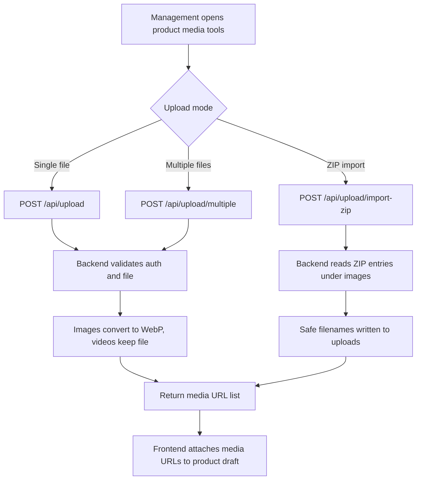
```mermaid
flowchart TD
    A[Management opens product media tools] --> B{Upload mode}
    B -->|Single file| C[POST /api/upload]
    B -->|Multiple files| D[POST /api/upload/multiple]
    B -->|ZIP import| E[POST /api/upload/import-zip]
    C --> F[Backend validates auth and file]
    D --> F
    E --> G[Backend reads ZIP entries under images]
    F --> H[Images convert to WebP, videos keep file]
    G --> I[Safe filenames written to uploads]
    H --> J[Return media URL list]
    I --> J
    J --> K[Frontend attaches media URLs to product draft]
```

### Flow: Product Create / Edit

**User goal:** Create, update, organize, hide, or VIP-gate catalog products.  
**Entry screen:** Product management panel.  
**Frontend route:** `/manage-products`  
**Key UI components:** `ManageProductsPanel`, `ProductFormModal`, category controls, quantity/discount controls  
**Relevant screenshot:** Needed  
**Backend endpoints:** `POST /api/products`, `PUT /api/products/:id`, `DELETE /api/products/:id`, category endpoints  
**State transitions:** form draft becomes validated product payload; backend persists product/category data; storefront reloads catalog.  
**Success state:** created/updated product appears in management and eligible storefront views.  
**Error/empty states:** validation error, missing category, unsupported quantity discount, admin-only delete denied.



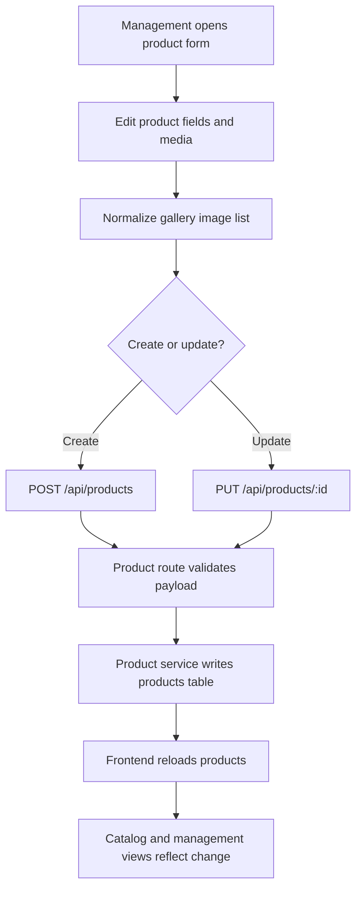
```mermaid
flowchart TD
    A[Management opens product form] --> B[Edit product fields and media]
    B --> C[Normalize gallery image list]
    C --> D{Create or update?}
    D -->|Create| E[POST /api/products]
    D -->|Update| F[PUT /api/products/:id]
    E --> G[Product route validates payload]
    F --> G
    G --> H[Product service writes products table]
    H --> I[Frontend reloads products]
    I --> J[Catalog and management views reflect change]
```

### Flow: Delivery Route

**User goal:** Build a route from ready orders and mark deliveries complete.  
**Entry screen:** `/delivery-dashboard`  
**Frontend route:** `/delivery-dashboard`  
**Key UI components:** `DeliveryDriverDashboard`, route edit controls, order cards  
**Relevant screenshot:** Needed  
**Backend endpoints:** `GET /api/orders/ready-for-delivery`, `GET /api/orders/out-for-delivery`, `PATCH /api/orders/:id/status`  
**State transitions:** `READY_FOR_DELIVERY` <-> `OUT_FOR_DELIVERY` -> `DELIVERED`; route selection max is 5 orders in the frontend.  
**Success state:** route panels refresh after save or delivery completion.  
**Error/empty states:** no ready orders, no active route, max route selection reached.



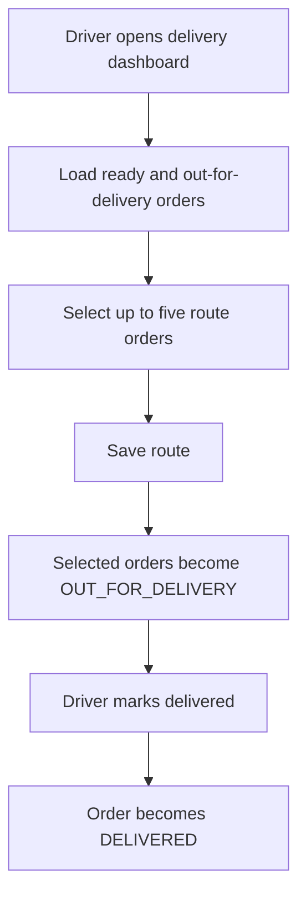
```mermaid
flowchart TD
    A[Driver opens delivery dashboard] --> B[Load ready and out-for-delivery orders]
    B --> C[Select up to five route orders]
    C --> D[Save route]
    D --> E[Selected orders become OUT_FOR_DELIVERY]
    E --> F[Driver marks delivered]
    F --> G[Order becomes DELIVERED]
```

### Flow: Admin / Configuration

**User goal:** Maintain users, messages, announcements, payments, store settings, ordering constraints, landing page content, and VIP configuration.  
**Entry screen:** `/dashboard`  
**Frontend route:** `/dashboard?section=...`  
**Key UI components:** `DashboardPage`, `AdminDashboardTabs`, section components, `AnnouncementModal`, confirmation modals  
**Relevant screenshot:** Needed  
**Backend endpoints:** users, announcements, contact messages, payment settings, store settings, ordering constraints, landing page settings, products  
**State transitions:** admin edits persisted to `ui_settings`, user roles/approval state, product VIP state, announcement enabled state.  
**Success state:** section state updates and shared config reloads where needed.  
**Error/empty states:** section load failures, invalid settings, empty user/message lists.



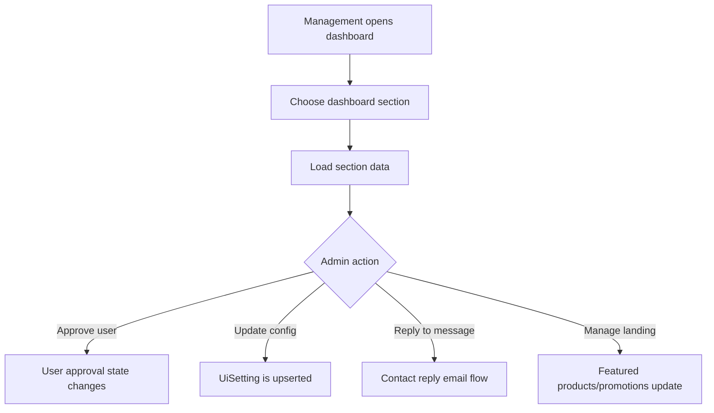
```mermaid
flowchart TD
    A[Management opens dashboard] --> B[Choose dashboard section]
    B --> C[Load section data]
    C --> D{Admin action}
    D -->|Approve user| E[User approval state changes]
    D -->|Update config| F[UiSetting is upserted]
    D -->|Reply to message| G[Contact reply email flow]
    D -->|Manage landing| H[Featured products/promotions update]
```

### Flow: Reporting / Export

**User goal:** Export product/media data or review completed order history.  
**Entry screen:** Product management or order history.  
**Frontend route:** `/manage-products`, `/order-history`  
**Key UI components:** product export action, `OrderHistoryPage`  
**Relevant screenshot:** Needed  
**Backend endpoints:** `GET /api/products/export-zip`, `GET /api/orders/delivered`  
**State transitions:** export streams product data and referenced images; order history reads delivered orders for admin review.  
**Success state:** ZIP download starts, or delivered order history renders.  
**Error/empty states:** no delivered orders, export failure, missing referenced image skipped/handled by export service.



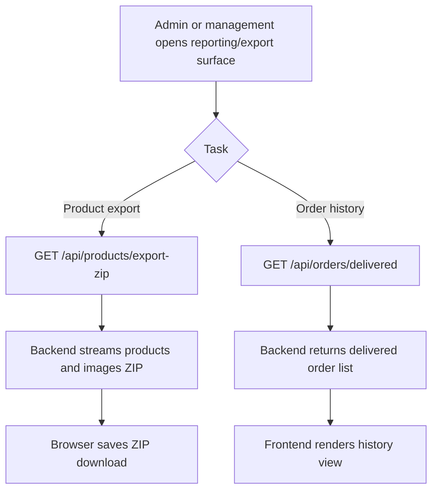
```mermaid
flowchart TD
    A[Admin or management opens reporting/export surface] --> B{Task}
    B -->|Product export| C[GET /api/products/export-zip]
    B -->|Order history| D[GET /api/orders/delivered]
    C --> E[Backend streams products and images ZIP]
    D --> F[Backend returns delivered order list]
    E --> G[Browser saves ZIP download]
    F --> H[Frontend renders history view]
```

### Flow: External Integration / Webhook and Print Agent

**User goal:** Send safe outbound notifications and support print jobs through external systems.  
**Entry screen:** Backend event services and print-agent polling  
**Frontend route:** Not directly user-routed for Make/print agent polling; staff actions trigger events.  
**Relevant screenshot:** Needed for staff print/reprint action.  
**Backend endpoints:** `POST /api/print-jobs/claim`, `POST /api/print-jobs/:id/success`, `POST /api/print-jobs/:id/failure`; Make delivery is service-side.  
**State transitions:** notification delivery statuses move through `PENDING`, `DELIVERED`, `DISABLED`, `FAILED`; print jobs move through `PENDING`, `CLAIMED`, `PRINTED`, `FAILED`.  
**Success state:** external handoff accepted or print job completed.  
**Error/empty states:** disabled webhook config, failed Make request, no print job available, print failure.



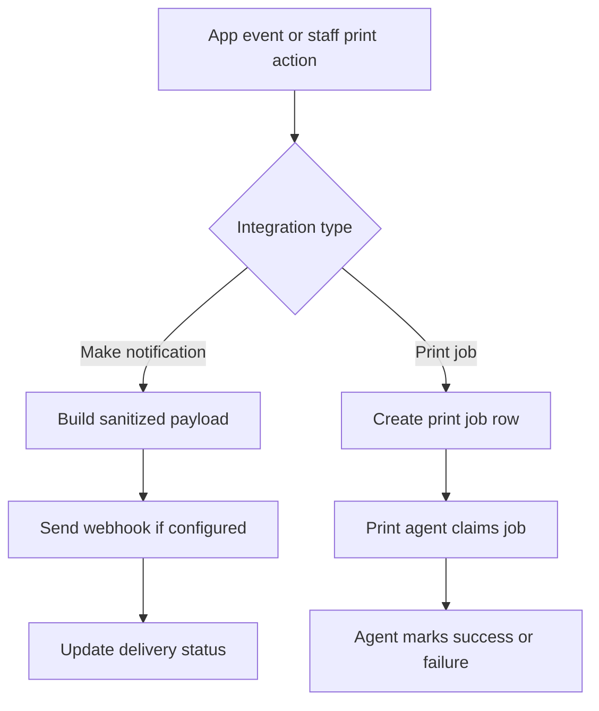
```mermaid
flowchart TD
    A[App event or staff print action] --> B{Integration type}
    B -->|Make notification| C[Build sanitized payload]
    C --> D[Send webhook if configured]
    D --> E[Update delivery status]
    B -->|Print job| F[Create print job row]
    F --> G[Print agent claims job]
    G --> H[Agent marks success or failure]
```

---

## 9. API Surface Overview

| Method | Path | Purpose | Auth Required | Related Flow |
|---|---|---|---|---|
| GET | `/api/health` | Health and database check | No | Operations |
| GET | `/api/config` | Shared tax, payment, store, delivery config | No | Browse / Checkout |
| GET | `/api/uploads/*` | Static uploaded media | No | Product media |
| POST | `/api/auth/register` | Register user | No | Authentication |
| POST | `/api/auth/login` | Login approved user | No | Authentication |
| GET | `/api/auth/profile` | Resolve current user | Bearer token | Authentication |
| POST | `/api/auth/logout` | Client-side logout acknowledgement | No | Authentication |
| GET | `/api/products` | Product list filtered by role | Optional token | Browse / Management |
| GET | `/api/products/export-zip` | Export products and images | Management/Admin | Product Management |
| GET | `/api/products/:id` | Product detail filtered by role | Optional token | Browse |
| POST | `/api/products` | Create product | Management/Admin | Product Management |
| PUT | `/api/products/:id` | Update product | Management/Admin | Product Management |
| DELETE | `/api/products/:id` | Delete product | Admin | Product Management |
| GET | `/api/categories` | Category tree/list | No | Browse / Management |
| POST | `/api/categories` | Create category | Management/Admin | Product Management |
| PUT | `/api/categories/:id` | Update category | Management/Admin | Product Management |
| DELETE | `/api/categories/:id` | Delete category | Management/Admin | Product Management |
| POST | `/api/upload` | Upload one media file | Management/Admin | Product Media |
| POST | `/api/upload/multiple` | Upload up to 20 media files | Management/Admin | Product Media |
| POST | `/api/upload/import-zip` | Import exported image ZIP | Management/Admin | Product Media |
| GET | `/api/upload` | List uploaded media | Management/Admin | Product Media |
| DELETE | `/api/upload/:filename` | Delete uploaded media | Management/Admin | Product Media |
| GET | `/api/orders` | List orders filtered by role | Authenticated | Orders |
| GET | `/api/orders/ready-for-delivery` | Ready delivery bucket | Admin/Management/Driver | Delivery |
| GET | `/api/orders/out-for-delivery` | Out-for-delivery bucket | Admin/Management/Driver | Delivery |
| GET | `/api/orders/delivered` | Delivered order history | Admin | Reporting |
| GET | `/api/orders/:id` | Order detail filtered by role | Authenticated | Orders |
| POST | `/api/orders/delivery-eligibility` | Check address deliverability | Authenticated | Checkout |
| POST | `/api/orders` | Create order | Authenticated | Checkout |
| PATCH | `/api/orders/:id/status` | Update order status | Role-dependent | Orders / Delivery |
| POST | `/api/orders/:id/items` | Add order item | Employee/Management/Admin | Orders |
| PATCH | `/api/orders/:id/items/:itemId/void` | Void order item | Employee/Management/Admin | Orders |
| DELETE | `/api/orders/:id/items/:itemId` | Delete order item | Employee/Management/Admin | Orders |
| POST | `/api/orders/:id/print` | Queue receipt reprint | Employee/Management/Admin | Print |
| DELETE | `/api/orders/:id` | Delete order | Admin | Orders |
| GET | `/api/users` | List users | Management/Admin | Admin |
| GET | `/api/users/roles` | List roles | Management/Admin | Admin |
| GET | `/api/users/pending` | Pending registrations | Management/Admin | Approval |
| GET | `/api/users/rejected` | Rejected users | Admin | Approval |
| GET | `/api/users/:id` | User detail | Own user or staff | Account |
| PUT | `/api/users/:id` | Update user | Own user or staff | Account/Admin |
| POST | `/api/users/:id/approve` | Approve user | Management/Admin | Approval |
| POST | `/api/users/:id/reject` | Reject user | Management/Admin | Approval |
| POST | `/api/users/:id/unreject` | Move rejected user back to pending | Management/Admin | Approval |
| DELETE | `/api/users/:id` | Delete user | Admin | Admin |
| GET | `/api/announcements/active` | Active announcements | No | App Shell |
| GET | `/api/announcements` | List announcements | Admin | Admin |
| GET | `/api/announcements/:id` | Announcement detail | Admin | Admin |
| POST | `/api/announcements` | Create announcement | Admin | Admin |
| PATCH | `/api/announcements/:id` | Update announcement | Admin | Admin |
| DELETE | `/api/announcements/:id` | Delete announcement | Admin | Admin |
| POST | `/api/contact` | Submit support message | Authenticated | Help |
| GET | `/api/contact/messages` | List messages | Management/Admin | Support Admin |
| GET | `/api/contact/messages/count` | Count new messages | Management/Admin | Support Admin |
| GET | `/api/contact/messages/:id` | Message detail | Management/Admin | Support Admin |
| PATCH | `/api/contact/messages/:id` | Update status/notes | Management/Admin | Support Admin |
| PATCH | `/api/contact/messages/:id/read` | Mark read | Management/Admin | Support Admin |
| PATCH | `/api/contact/messages/:id/resolve` | Mark resolved | Management/Admin | Support Admin |
| POST | `/api/contact/messages/:id/reply` | Reply to customer | Management/Admin | Support Admin / Make |
| DELETE | `/api/contact/messages/:id` | Delete message | Admin | Support Admin |
| GET | `/api/notifications` | Notification inbox | Authenticated | Notifications |
| GET | `/api/notifications/unread-count` | Unread notification count | Authenticated | Notifications |
| PATCH | `/api/notifications/:id/read` | Mark one read | Authenticated | Notifications |
| PATCH | `/api/notifications/read-all` | Mark all read | Authenticated | Notifications |
| GET | `/api/notifications/staff` | Staff badge counts | Employee/Management/Admin | Staff |
| GET | `/api/payment-settings` | Payment settings | Admin | Admin Config |
| PUT | `/api/payment-settings` | Update payment settings | Admin | Admin Config |
| GET | `/api/store-settings` | Store settings | Admin | Admin Config |
| PUT | `/api/store-settings` | Update store settings | Admin | Admin Config |
| GET | `/api/ordering-constraints` | Ordering constraints | Admin | Admin Config |
| PUT | `/api/ordering-constraints` | Update ordering constraints | Admin | Admin Config |
| GET | `/api/landing-page-settings` | Landing settings | Management/Admin | Landing Config |
| PUT | `/api/landing-page-settings` | Update landing settings | Management/Admin | Landing Config |
| GET | `/api/credits/:userId` | User credit balance | Own user or staff | Store Credit |
| GET | `/api/credits/:userId/transactions` | Credit transactions | Own user or staff | Store Credit |
| POST | `/api/credits/:userId/add` | Add credit | Management/Admin | Store Credit |
| POST | `/api/credits/:userId/remove` | Remove credit | Management/Admin | Store Credit |
| POST | `/api/print-jobs/claim` | Print agent claims next job | Print agent token | Print Agent |
| POST | `/api/print-jobs/:id/success` | Print agent reports success | Print agent token | Print Agent |
| POST | `/api/print-jobs/:id/failure` | Print agent reports failure | Print agent token | Print Agent |

---

## 10. Endpoint Design Details

### Endpoint Group: Auth

**Endpoints:** `POST /api/auth/register`, `POST /api/auth/login`, `GET /api/auth/profile`, `POST /api/auth/logout`  
**Purpose:** Account creation, login, profile rehydration, and local logout acknowledgement.  
**Auth/roles:** register/login/logout public; profile requires bearer token.  
**Related screens:** `/register`, `/login`, protected routes.

#### Register Request

```json
{
  "username": "demo_user",
  "password": "password123",
  "phoneNumber": "555-0100",
  "address": "123 Demo St, Houston, TX 77083",
  "cashapp": "$demo"
}
```

#### Login Response

```json
{
  "message": "Login successful",
  "user": {
    "id": 1,
    "username": "demo_user",
    "roles": ["CUSTOMER"],
    "approved": true
  },
  "token": "fake.jwt.token"
}
```



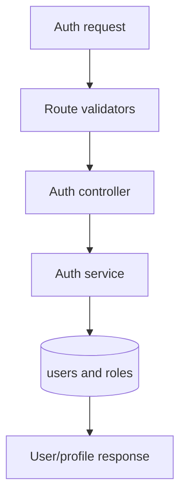
```mermaid
flowchart TD
    A[Auth request] --> B[Route validators]
    B --> C[Auth controller]
    C --> D[Auth service]
    D --> E[(users and roles)]
    E --> F[User/profile response]
```

### Endpoint Group: Catalog, Categories, and Media

**Endpoints:** products, categories, uploads, exported product ZIP.  
**Purpose:** Browse catalog and manage product/category/media records.  
**Auth/roles:** product/category reads are public or optional-auth; mutations require management/admin; product delete requires admin.  
**Related screens:** `/`, `/products`, `/products/:id`, `/manage-products`, `/dashboard?section=vip-management`.

#### Product Create Request

```json
{
  "name": "Demo Product",
  "categoryId": 1,
  "price": 19.99,
  "description": "Demo description",
  "images": ["/api/uploads/demo.webp"],
  "image": "/api/uploads/demo.webp",
  "stock": 12,
  "stockEnabled": true,
  "hidden": false,
  "vipOnly": false
}
```

#### Upload Response

```json
{
  "url": "/api/uploads/demo.webp"
}
```



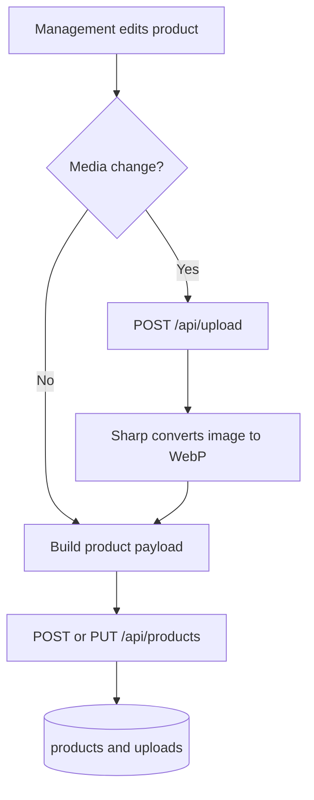
```mermaid
flowchart TD
    A[Management edits product] --> B{Media change?}
    B -->|Yes| C[POST /api/upload]
    C --> D[Sharp converts image to WebP]
    B -->|No| E[Build product payload]
    D --> E
    E --> F[POST or PUT /api/products]
    F --> G[(products and uploads)]
```

### Endpoint Group: Orders and Delivery

**Endpoints:** order listing/detail, checkout, delivery eligibility, status changes, item edits, printing, deletion.  
**Purpose:** Create customer orders and support staff/driver operations.  
**Auth/roles:** all order endpoints require auth; delivery driver is limited to delivery buckets and `DELIVERED` status updates; staff/admin can edit orders; admin deletes.  
**Related screens:** `/checkout`, `/orders`, `/delivery-dashboard`, `/order-history`.

#### Create Order Request

```json
{
  "items": [
    { "productId": 1, "quantity": 2 }
  ],
  "deliveryMethod": "PICKUP",
  "paymentMethod": "EXTERNAL",
  "cashAppUsername": "$demo"
}
```

#### Delivery Eligibility Response

```json
{
  "deliverable": true,
  "deliveryZoneStatus": "IN_ZONE",
  "deliveryZoneSource": "ZIP_FALLBACK",
  "distanceMiles": null,
  "thresholdMiles": 5,
  "message": "Delivery is available for this address."
}
```



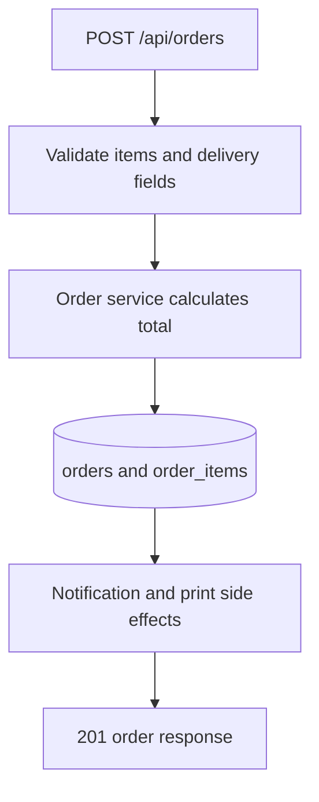
```mermaid
flowchart TD
    A[POST /api/orders] --> B[Validate items and delivery fields]
    B --> C[Order service calculates total]
    C --> D[(orders and order_items)]
    D --> E[Notification and print side effects]
    E --> F[201 order response]
```

### Endpoint Group: Users, Roles, and Store Credit

**Endpoints:** user CRUD, pending/rejected approval, roles, credit balance/transactions/add/remove.  
**Purpose:** Account administration and credit ledger management.  
**Auth/roles:** own user or staff for profile/credit reads; management/admin for approval and credit mutation; admin for rejected list and deletes.  
**Related screens:** `/profile`, `/dashboard`, `/store-credit`.

```json
{
  "roles": ["CUSTOMER", "VIP"],
  "phoneNumber": "555-0100",
  "address": "123 Demo St, Houston, TX 77083"
}
```



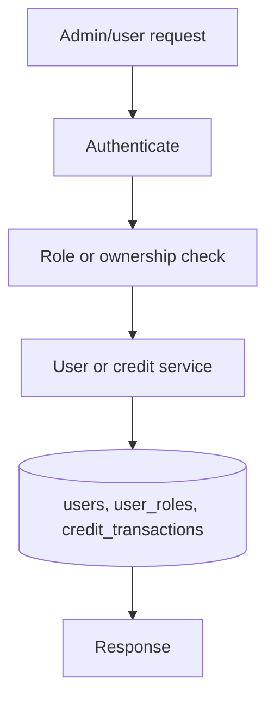
```mermaid
flowchart TD
    A[Admin/user request] --> B[Authenticate]
    B --> C[Role or ownership check]
    C --> D[User or credit service]
    D --> E[(users, user_roles, credit_transactions)]
    E --> F[Response]
```

### Endpoint Group: Dashboard Configuration

**Endpoints:** announcements, payment settings, store settings, ordering constraints, landing page settings.  
**Purpose:** Configure storefront messaging, payment handles, store contact/address, delivery constraints, featured products, and promotion slides.  
**Auth/roles:** mostly admin; landing settings allow management/admin.  
**Related screens:** `/dashboard`.

```json
{
  "minimumDeliveryOrder": 35,
  "minimumDeliveryOrderEnabled": true,
  "deliveryDisabled": false,
  "deliveryDisabledMessage": "",
  "deliveryRadiusMiles": 5,
  "offlineZipFallbackEnabled": true,
  "offlineDeliveryZipCodes": ["77083"]
}
```



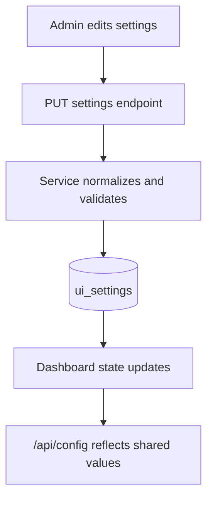
```mermaid
flowchart TD
    A[Admin edits settings] --> B[PUT settings endpoint]
    B --> C[Service normalizes and validates]
    C --> D[(ui_settings)]
    D --> E[Dashboard state updates]
    E --> F["/api/config reflects shared values"]
```

### Endpoint Group: Contact, Notifications, Make, and Print Agent

**Endpoints:** contact form/message management/reply, notifications, print-job polling endpoints.  
**Purpose:** Support messaging, in-app notification inbox/badges, outbound Make delivery, and local thermal print jobs.  
**Auth/roles:** contact submission requires auth; message management requires management/admin; print job endpoints require print-agent auth.  
**Related screens:** `/help`, `/dashboard?section=messages`, notification dropdown, `/orders`.

```json
{
  "eventType": "ORDER_CREATED",
  "category": "ORDERS",
  "channelIntent": "ops_alert",
  "notificationId": 123,
  "recipient": { "userId": 45 },
  "entity": { "type": "ORDER", "id": 987 },
  "message": {
    "title": "New order submitted",
    "body": "Order #987 is waiting for review."
  },
  "requiresAttention": true
}
```



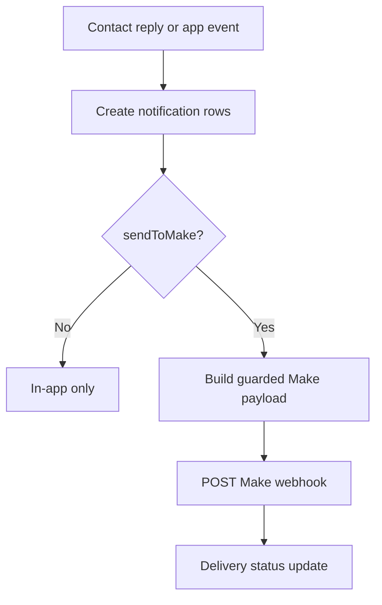
```mermaid
flowchart TD
    A[Contact reply or app event] --> B[Create notification rows]
    B --> C{sendToMake?}
    C -->|No| D[In-app only]
    C -->|Yes| E[Build guarded Make payload]
    E --> F[POST Make webhook]
    F --> G[Delivery status update]
```

---

## 11. Public-Facing API Contracts

### Browser Client API

External consumer: React browser app.  
Authentication method: bearer token stored by `web/src/services/api.js`; some endpoints are public or optional-auth.  
Versioning assumptions: no explicit API version prefix beyond `/api`.  
Rate-limit assumptions: backend applies auth, general, and read/write rate limit middleware.

### Print Agent API

External consumer: local thermal print agent.  
Authentication method: `x-print-agent-key` header must match `PRINT_AGENT_SHARED_KEY`; if the env var is missing, print-agent endpoints return `503 PRINT_AGENT_AUTH_NOT_CONFIGURED`.  
Endpoints: `POST /api/print-jobs/claim`, `POST /api/print-jobs/:id/success`, `POST /api/print-jobs/:id/failure`.  
Request bodies:

```json
{
  "agentId": "local-print-agent-1"
}
```

Success callback may also include `nativeJobId`; failure callback requires `errorCode` and `errorMessage`.

Idempotency and retry behavior: claiming takes the oldest `PENDING` job, or a `CLAIMED` job older than 5 minutes, and marks it `CLAIMED` for the submitted `agentId`. Success/failure updates only work while the job is still `CLAIMED` by that same `agentId`; repeated callbacks after a terminal state return the service's not-found-for-agent error.

### Make Webhook Payloads

External consumer: Make.com scenarios.  
Authentication method: app sends `x-make-apikey` to configured webhook URLs.  
Source of truth: `backend/MAKE_OUTBOUND_NOTIFICATION_FLOW.md`, `notificationDelivery.service.ts`, `email.service.ts`.  
Safety: app blocks email-intent notification payloads without recipient email fields; contact reply notification events are in-app only while actual replies go through `emailService.sendReplyEmail`.

---

## 12. JSON Data Structures

### Object: User

**Purpose:** Authenticated identity, profile, approval, roles, and delivery/payment metadata.  
**Producer:** Auth/user services.  
**Consumers:** App context, protected routes, dashboard, profile, orders.  
**Source of truth:** Prisma `User`, `Role`, `UserRole`.

```json
{
  "id": 1,
  "username": "demo_user",
  "roles": ["CUSTOMER"],
  "approved": true,
  "phoneNumber": "555-0100",
  "address": "123 Demo St, Houston, TX 77083",
  "cashapp": "$demo",
  "creditBalance": 0
}
```

### Object: ProductItem

**Purpose:** Catalog item with pricing, category, media, stock, visibility, VIP, quantity, and discount controls.  
**Producer:** Product service.  
**Consumers:** Landing/catalog/cart/admin/product management.

```json
{
  "id": 1,
  "name": "Demo Product",
  "price": 19.99,
  "description": "Demo description",
  "thumbnail": "/api/uploads/demo.webp",
  "image": "/api/uploads/demo.webp",
  "images": ["/api/uploads/demo.webp"],
  "stock": 12,
  "stockEnabled": true,
  "hidden": false,
  "vipOnly": false,
  "categoryId": 1
}
```

### Object: Order

**Purpose:** Customer order and staff workflow state.  
**Producer:** Order service.  
**Consumers:** Checkout, orders board, delivery board, print jobs, notifications.

```json
{
  "id": 987,
  "userId": 45,
  "status": "PENDING",
  "total": 42.5,
  "deliveryMethod": "PICKUP",
  "paymentMethod": "EXTERNAL",
  "items": [
    {
      "id": 1,
      "productId": 1,
      "quantity": 2,
      "price": 19.99,
      "voided": false
    }
  ]
}
```

### Object: UiSetting Values

**Purpose:** Store runtime configuration in `ui_settings`.  
**Producer:** settings services.  
**Consumers:** `/api/config`, dashboard sections, checkout, landing page.

```json
{
  "payment_settings": {
    "cashapp": { "enabled": true, "handle": "$DemoStore" },
    "zelle": { "enabled": false, "handle": "" },
    "venmo": { "enabled": false, "handle": "" }
  },
  "landing_page_settings": {
    "featuredProductIds": [1, 2],
    "promotions": [
      { "url": "/api/uploads/promo.webp", "description": "Demo promotion" }
    ]
  }
}
```

### Object: Notification

**Purpose:** In-app and optional outbound event record.  
**Producer:** notification event services.  
**Consumers:** notification dropdown, staff badges, Make delivery.

```json
{
  "id": 123,
  "recipientUserId": 45,
  "type": "ORDER_CREATED",
  "category": "ORDERS",
  "title": "New order submitted",
  "message": "Order #987 is waiting for review.",
  "requiresAttention": true,
  "readAt": null,
  "deliveryStatus": "PENDING"
}
```

---

## 13. End-to-End Flow Diagrams

Section 8 contains flow-specific Mermaid diagrams for the major user journeys. The system-wide diagrams below show how those flows cross application boundaries.

### Application Boundary



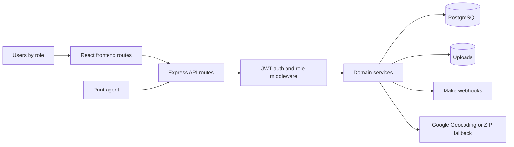
```mermaid
flowchart LR
    U[Users by role] --> FE[React frontend routes]
    FE --> API[Express API routes]
    API --> AUTH[JWT auth and role middleware]
    AUTH --> SVC[Domain services]
    SVC --> DB[(PostgreSQL)]
    SVC --> UP[(Uploads)]
    SVC --> MAKE[Make webhooks]
    PRINT[Print agent] --> API
    SVC --> GEO[Google Geocoding or ZIP fallback]
```

### Role-Gated Navigation



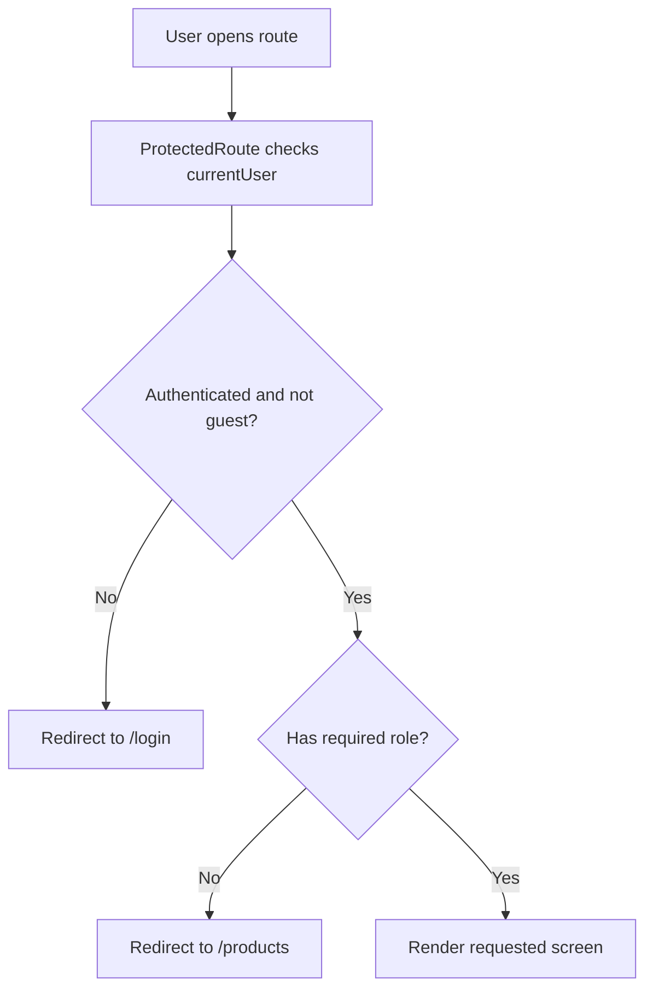
```mermaid
flowchart TD
    A[User opens route] --> B[ProtectedRoute checks currentUser]
    B --> C{Authenticated and not guest?}
    C -->|No| D[Redirect to /login]
    C -->|Yes| E{Has required role?}
    E -->|No| F[Redirect to /products]
    E -->|Yes| G[Render requested screen]
```

---

## 14. Endpoint Flow Diagrams

Section 10 contains endpoint-group Mermaid diagrams for non-trivial endpoint families. Individual trivial CRUD endpoints are grouped by domain to keep the document readable.

### Shared API Request Pipeline



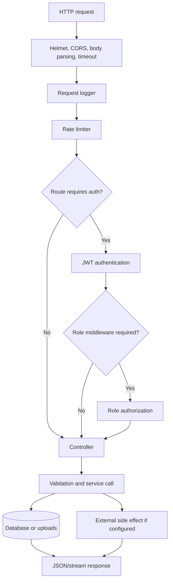
```mermaid
flowchart TD
    A[HTTP request] --> B[Helmet, CORS, body parsing, timeout]
    B --> C[Request logger]
    C --> D[Rate limiter]
    D --> E{Route requires auth?}
    E -->|No| F[Controller]
    E -->|Yes| G[JWT authentication]
    G --> H{Role middleware required?}
    H -->|No| F
    H -->|Yes| I[Role authorization]
    I --> F
    F --> J[Validation and service call]
    J --> K[(Database or uploads)]
    J --> L[External side effect if configured]
    K --> M[JSON/stream response]
    L --> M
```

### Trivial Endpoint Omission Rule

> Mermaid endpoint diagram omitted for static or read-only endpoints only when the endpoint has no branching, no side effects, and is already covered by the shared API request pipeline above.

---

## 15. Screenshot Catalog

| Screenshot | File | Related Flow | Status | Notes |
|---|---|---|---|---|
| Login screen | `design-assets/screenshots/login-screen.png` | Authentication | Present | Captured from local `/login`; empty public form. |
| Register screen | `design-assets/screenshots/register-screen.png` | Authentication | Present | Captured from local `/register`; empty public form and public store approval notice. |
| Primary authenticated app layout | `design-assets/screenshots/primary-app-layout.png` | App Shell | Needed | Capture with seeded/demo authenticated account only. |
| Landing page hero and featured grid | `design-assets/screenshots/landing-page.png` | Browse / Search | Needed | Capture with demo products and no private data. |
| Products browse page | `design-assets/screenshots/products-browse.png` | Browse / Cart | Needed | Capture with demo catalog data. |
| Product detail modal | `design-assets/screenshots/product-detail-modal.png` | Browse / Cart | Needed | Capture with demo product. |
| Cart page | `design-assets/screenshots/cart-page.png` | Cart / Checkout | Needed | Capture with demo cart contents. |
| Checkout pickup/delivery form | `design-assets/screenshots/checkout-page.png` | Checkout | Needed | Capture with fake address/payment placeholder only. |
| External payment modal | `design-assets/screenshots/external-payment-modal.png` | Checkout | Needed | Must not expose real payment handles. |
| Staff orders board | `design-assets/screenshots/orders-board.png` | Order Operations | Needed | Capture with seeded demo orders only. |
| Order detail panel | `design-assets/screenshots/order-detail-panel.png` | Order Operations | Needed | Must not expose customer address, phone, or payment data. |
| Delivery dashboard | `design-assets/screenshots/delivery-dashboard.png` | Delivery | Needed | Capture with demo route/order cards. |
| Admin dashboard overview | `design-assets/screenshots/admin-dashboard.png` | Admin / Configuration | Needed | Capture with demo users/messages/settings. |
| Product management panel | `design-assets/screenshots/product-management.png` | Product Management | Needed | Capture with demo products and media. |
| Contact messages section | `design-assets/screenshots/contact-messages.png` | Support Admin | Needed | Must use fake messages and no real email/phone data. |
| Mobile layout | `design-assets/screenshots/mobile-layout.png` | Responsive UX | Needed | Capture mobile viewport with demo data. |

---

## 16. Icon / Visual Asset Catalog

| Asset | File | Purpose | Status |
|---|---|---|---|
| Review required icon | `design-assets/icons/review-required.svg` | Marks review-gated approval/order/admin workflows | Present |
| External integration icon | `design-assets/icons/external-integration.svg` | Marks Make and print-agent integration boundaries | Present |
| Data ownership diagram | `design-assets/diagrams/data-ownership-boundary.svg` | Shows browser/API/database/uploads/external boundaries | Present |
| Application boundary Mermaid render | `design-assets/diagrams/application-boundary.svg` | Rendered system boundary flowchart | Present |
| Shared API pipeline Mermaid render | `design-assets/diagrams/shared-api-request-pipeline.svg` | Rendered request lifecycle flowchart | Present |
| Data ownership Mermaid render | `design-assets/diagrams/data-ownership-flow.svg` | Rendered source-of-truth flowchart | Present |
| User-flow Mermaid renders | `design-assets/diagrams/flow-*.svg` | Rendered major user-flow diagrams | Present |
| Endpoint-group Mermaid renders | `design-assets/diagrams/endpoint-group-*.svg` | Rendered endpoint-flow diagrams | Present |
| Login screen screenshot | `design-assets/screenshots/login-screen.png` | Shows public auth visual design | Present |
| Register screen screenshot | `design-assets/screenshots/register-screen.png` | Shows public account request visual design | Present |
| Primary authenticated screenshots | `design-assets/screenshots/*.png` | Screen-level design references for protected workflows | Needed |

---

## Diagram Catalog

| Diagram | SVG | Source | Related Section | Status |
|---|---|---|---|---|
| Application boundary diagram | `design-assets/diagrams/application-boundary-diagram.svg` | Mermaid block in this document | Visual Design Reference / Application Boundary Diagram | Rendered |
| Authentication and approval flow | `design-assets/diagrams/flow-authentication-and-approval.svg` | Mermaid block in this document | Flow: Authentication and Approval | Rendered |
| Browse, cart, and checkout flow | `design-assets/diagrams/flow-browse-cart-and-checkout.svg` | Mermaid block in this document | Flow: Browse, Cart, and Checkout | Rendered |
| Staff order operations flow | `design-assets/diagrams/flow-staff-order-operations.svg` | Mermaid block in this document | Flow: Staff Order Operations | Rendered |
| Product media upload / import flow | `design-assets/diagrams/flow-product-media-upload-import.svg` | Mermaid block in this document | Flow: Product Media Upload / Import | Rendered |
| Product create / edit flow | `design-assets/diagrams/flow-product-create-edit.svg` | Mermaid block in this document | Flow: Product Create / Edit | Rendered |
| Delivery route flow | `design-assets/diagrams/flow-delivery-route.svg` | Mermaid block in this document | Flow: Delivery Route | Rendered |
| Admin configuration flow | `design-assets/diagrams/flow-admin-configuration.svg` | Mermaid block in this document | Flow: Admin / Configuration | Rendered |
| Reporting / export flow | `design-assets/diagrams/flow-reporting-export.svg` | Mermaid block in this document | Flow: Reporting / Export | Rendered |
| External integration webhook and print agent flow | `design-assets/diagrams/flow-external-integration-webhook-and-print-agent.svg` | Mermaid block in this document | Flow: External Integration / Webhook and Print Agent | Rendered |
| Auth endpoint flow | `design-assets/diagrams/endpoint-group-auth.svg` | Mermaid block in this document | Endpoint Group: Auth | Rendered |
| Catalog categories and media endpoint flow | `design-assets/diagrams/endpoint-group-catalog-categories-media.svg` | Mermaid block in this document | Endpoint Group: Catalog, Categories, and Media | Rendered |
| Orders and delivery endpoint flow | `design-assets/diagrams/endpoint-group-orders-delivery.svg` | Mermaid block in this document | Endpoint Group: Orders and Delivery | Rendered |
| Users roles and store credit endpoint flow | `design-assets/diagrams/endpoint-group-users-roles-and-store-credit.svg` | Mermaid block in this document | Endpoint Group: Users, Roles, and Store Credit | Rendered |
| Dashboard configuration endpoint flow | `design-assets/diagrams/endpoint-group-dashboard-configuration.svg` | Mermaid block in this document | Endpoint Group: Dashboard Configuration | Rendered |
| Contact notifications Make and print agent endpoint flow | `design-assets/diagrams/endpoint-group-contact-notifications-make-and-print-agent.svg` | Mermaid block in this document | Endpoint Group: Contact, Notifications, Make, and Print Agent | Rendered |
| Application boundary | `design-assets/diagrams/application-boundary.svg` | Mermaid block in this document | End-to-End Flow Diagrams / Application Boundary | Rendered |
| Role-gated navigation | `design-assets/diagrams/role-gated-navigation.svg` | Mermaid block in this document | End-to-End Flow Diagrams / Role-Gated Navigation | Rendered |
| Shared API request pipeline | `design-assets/diagrams/shared-api-request-pipeline.svg` | Mermaid block in this document | Endpoint Flow Diagrams / Shared API Request Pipeline | Rendered |
| Data ownership flow | `design-assets/diagrams/data-ownership-flow.svg` | Mermaid block in this document | Data Ownership and Source-of-Truth Rules | Rendered |
| Data ownership boundary | `design-assets/diagrams/data-ownership-boundary.svg` | Static SVG visual asset | Data Ownership and Source-of-Truth Rules | Present |

---

## 17. Integration Boundaries

- Browser/API boundary: frontend service modules call `/api/*` through shared `api.js` and upload-specific `fetch` calls.
- Database boundary: backend services own Prisma writes and reads; frontend should not infer database shape beyond API responses.
- Upload boundary: media files are written under backend `uploads` and served at `/api/uploads/*`; product records store URLs/arrays.
- Make boundary: notification and contact reply flows use Make webhook configuration and API key headers; payloads must stay sanitized.
- Print-agent boundary: print agent polls `/api/print-jobs/*` with `x-print-agent-key`; print job payloads are stored in PostgreSQL and are agent-claimed before success/failure callbacks.
- Google/geocoding boundary: delivery eligibility first checks `address_geocode_cache`, then calls the Google Geocoding API when `GOOGLE_GEOCODING_API_KEY` is configured, using `GOOGLE_GEOCODING_TIMEOUT_MS` or a 5000 ms default timeout. Provider failures fall back to ZIP eligibility when offline fallback is enabled.
- Docker/runtime boundary: local dev stack exposes frontend `5843`, backend `3000`, database host port `15432`.

---

## 18. Data Ownership and Source-of-Truth Rules




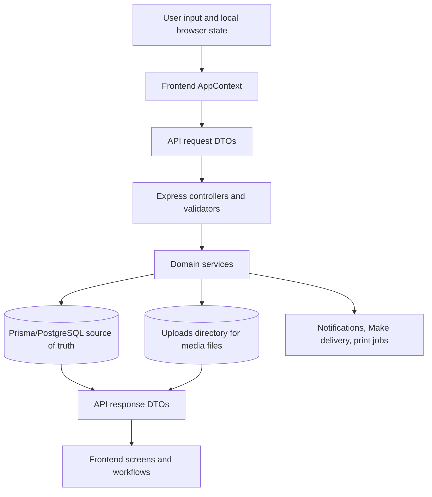
```mermaid
flowchart TD
    A[User input and local browser state] --> B[Frontend AppContext]
    B --> C[API request DTOs]
    C --> D[Express controllers and validators]
    D --> E[Domain services]
    E --> F[(Prisma/PostgreSQL source of truth)]
    E --> G[(Uploads directory for media files)]
    F --> H[API response DTOs]
    G --> H
    H --> I[Frontend screens and workflows]
    E --> J[Notifications, Make delivery, print jobs]
```

- `users`, `roles`, `user_roles`: backend auth/user services.
- `products`, `categories`, upload files: product/category/upload services; product management UI is a consumer.
- `orders`, `order_items`: order service; checkout and staff boards are consumers.
- `ui_settings`: settings services own validation and defaults for payment, store, ordering constraints, and landing settings.
- `notifications`: notification service/event services own in-app delivery records.
- `print_jobs`: print job service owns queued print payload lifecycle.
- `cartData` in localStorage: frontend `AppContext` owns cart persistence until checkout/order recovery clears or restores it.
- `userData` and token localStorage: frontend auth services own browser session persistence.

---

## 19. Error Handling and Empty States

- Backend uses validation errors, `AppError`, global error middleware, request logging, and request timeouts.
- Frontend API client preserves normalized errors, handles request timeouts, retries selected requests, and prevents stale-session `401` responses from clearing a newer token.
- Checkout validates address completeness, delivery eligibility, CashApp handle format, credit sufficiency, and delivery minimum/disabled rules before order creation.
- Product/category/order mutations show notification errors.
- Delivery dashboard shows small empty states for no ready orders or no route.
- Products page uses `EmptyState` for loading and empty catalog states.
- Needs verification: complete visual inventory for all error/empty/success states.

---

## 20. Security and Access Control Design

- Express applies Helmet, CORS, JSON/body size limits, request timeouts, request logging, and route-level rate limiters.
- Production startup rejects wildcard CORS and missing required env vars.
- JWT auth middleware populates `req.user`; role middleware gates management/admin/employee/driver actions.
- Frontend `ProtectedRoute` redirects unauthenticated/guest users to `/login` and role mismatches to `/products`.
- Upload endpoints require management/admin and use safe basename handling for delete/import.
- Print job endpoints use print-agent authentication separate from browser user auth.
- Sensitive screenshot rule: do not include unredacted customer, payment, address, phone, email, secret, or production data.

---

## 21. Feature Flags and Configuration

No formal feature-flag system was found. Runtime configuration is handled through environment variables and `ui_settings`.

Known configurable areas:

- `DEFAULT_TAX_RATE` in backend constants
- payment settings: CashApp, Zelle, Venmo enabled/handle
- store settings: name, address, phone, notification email routing
- ordering constraints: delivery minimum, delivery disabled message, radius, offline ZIP fallback
- landing page settings: featured products and promotions
- frontend polling env vars: notification, staff counts, and order polling intervals
- backend env: JWT, CORS, request timeout, Make webhook/API key, database URL, trust proxy, print-agent auth settings

---

## 22. Known Design Constraints

- Registration creates unapproved users; login requires approval.
- User roles are arrays in current frontend/backend contract.
- Cart refresh persistence depends on `localStorage['cartData']`.
- Product save logic must omit `image` when no real string URL exists.
- Product media upload accepts only supported image/video formats in frontend management flows; image uploads are converted to WebP unless video.
- Prisma schema changes must include committed SQL migrations.
- Delivery verification has offline ZIP fallback defaults including `77083`, uses cached geocodes when present, and otherwise calls Google Geocoding when configured.
- Delivery drivers can only mark orders as `DELIVERED` when they are not also broader staff roles.
- Route editing in the delivery dashboard is capped at 5 selected orders in the frontend.
- Contact reply email delivery and notification delivery have separate Make/email behavior.
- VIP is an additive visibility role, not a standalone route-access role in the current frontend route map.
- Print-agent callbacks are agent-scoped and state-scoped; stale or repeated terminal callbacks do not update printed/failed jobs again.
- `/api/config` currently returns tax/payment/store/ordering values but not landing page featured product or promotion settings.

---

## 23. Documentation Drift / Needs Verification

| Area | Issue | Verification Needed |
|---|---|---|
| `backend/BACKEND_CONTEXT.md` | Historical context doc contains older auth/schema examples and is now labeled Needs verification. | Keep using route/service code, Prisma schema, and `docs/PROJECT_DESIGN.md` for current truth. |
| Docker docs | Some older Docker docs contain outdated port/service examples and mojibake. | Prefer `README.md` and `LOCAL_DOCKER_DEV_WORKFLOW.md` for current dev startup. |
| Screenshots | Public login and register screenshots are present; protected workflow screenshots still need safe demo data. | Generate remaining demo-data screenshots later and place them under `docs/design-assets/screenshots/`. |
| Mobile/iPad UX | Responsive files exist, but rendered mobile/iPad state was not captured. | Browser screenshot pass with safe demo data. |
| Landing settings hydration | `AppContext` reads `featuredProductIds` and `promotions` from `/api/config`, but `backend/src/index.ts` does not currently include landing page settings in that config response. | Verify whether landing page settings should be added to `/api/config` or loaded through `GET /api/landing-page-settings` for authenticated storefront users. |
| VIP route access | Product filtering references `VIP`, but route guard arrays do not include `VIP` alone. | Verify whether that additive-role model is intentional product policy. |

---

## 24. Last Updated

- Date: 2026-06-02
- Updated by: Codex
- Inspected areas:
  - `AGENTS.md`
  - `README.md`
  - `CODEBASE_WORKING_DOCUMENT.md`
  - `LOCAL_DOCKER_DEV_WORKFLOW.md`
  - `DEPLOYMENT_CHECKLIST.md`
  - `INCIDENT_2026-04-26_prod_image_upload_failure.md`
  - `backend/MAKE_OUTBOUND_NOTIFICATION_FLOW.md`
  - `backend/src/index.ts`
  - `backend/src/routes/*.ts`
  - `backend/src/middleware/printAgentAuth.middleware.ts`
  - selected backend controllers and services
  - `backend/src/services/deliveryEligibility.service.ts`
  - `backend/src/services/printJob.service.ts`
  - `backend/prisma/schema.prisma`
  - `web/src/App.jsx`
  - `web/src/context/AppContext.jsx`
  - `web/src/services/*.js`
  - selected frontend pages for landing, products, checkout, orders, delivery, and dashboard
  - existing visual asset locations under `web/public`, `web/src/assets`, and common screenshot/report folders
  - `scripts/render-design-mermaid.js`
  - `package.json`
- Visual assets added:
  - `docs/design-assets/screenshots/login-screen.png`
  - `docs/design-assets/screenshots/register-screen.png`
  - `docs/design-assets/icons/review-required.svg`
  - `docs/design-assets/icons/external-integration.svg`
  - `docs/design-assets/diagrams/data-ownership-boundary.svg`
  - rendered Mermaid SVG diagrams under `docs/design-assets/diagrams/`
  - `docs/design-assets/diagrams/manifest.json`
- Documentation tooling added:
  - `scripts/render-design-mermaid.js`
  - `npm run docs:render-mermaid`
- Screenshots needed:
  - primary app layout
  - landing/catalog/cart/checkout
  - staff order board
  - delivery dashboard
  - admin dashboard sections
  - mobile layout
- Known gaps:
  - screenshots need safe demo data
  - mobile/iPad visual verification not completed
  - landing settings hydration mismatch needs product/implementation decision
  - VIP additive-role policy needs product confirmation
