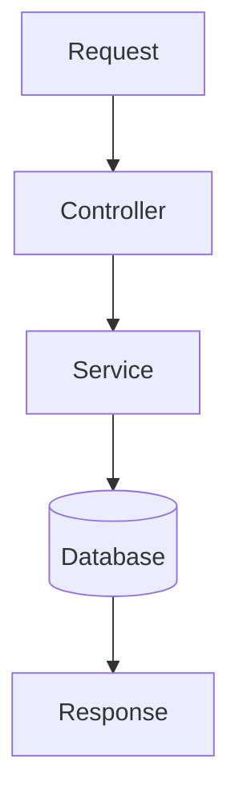

# Agent Working Agreement

## Required Startup Workflow

Before starting any debugging task, starting the application, or beginning new/updated feature work, the agent must:

1. Read relevant project documentation first (root docs and feature-specific docs).
2. Review recent incident notes, deployment notes, and workflow docs to capture prior decisions.
3. Start or verify local application services before making code changes.
4. Confirm assumptions against existing docs and current behavior before proposing fixes.

## Goal

Prevent repeated mistakes, preserve previous work, and keep implementation consistent across sessions.

## Project Design Documentation

When the user says "update design documents", update the project-level app design documentation.

When the user asks to clean or audit project documentation, do not change application behavior. Verify docs against current code, mark unclear behavior as `Needs verification`, and preserve useful historical context by archiving or clearly labeling it instead of deleting it blindly.

Follow:

- `docs/DESIGN_DOCUMENTATION_INSTRUCTIONS.md`
- `docs/PROJECT_DESIGN.md`

This design documentation is separate from normal changelogs, implementation notes, release notes, architecture notes, and task-specific documentation.

Do not replace existing documentation conventions.

The project design document must describe the current application design, including:

- user flows
- UI/UX doctrine
- routes and screens
- backend endpoints
- public-facing APIs
- request/response JSON examples
- core data structures
- endpoint-level Mermaid flow diagrams
- end-to-end user-flow Mermaid diagrams
- screenshots where valuable
- visual cues such as icons, images, vectors, diagrams, and annotated UI references
- known design constraints
- feature boundaries
- integration boundaries

When updating design documents:

1. Inspect the current codebase.
2. Identify implemented routes, endpoints, DTOs, controllers, services, API clients, stores, pages, and user flows.
3. Update `docs/PROJECT_DESIGN.md` to match the current implementation.
4. If `docs/PROJECT_DESIGN.md` does not exist, create it.
5. Preserve existing project documentation unless the user explicitly asks to modify it.
6. Do not invent endpoints, screens, payloads, or behavior.
7. Mark uncertain or inferred behavior clearly as `Needs verification`.
8. Add screenshots, icons, vectors, diagrams, and visual references where they improve understanding.
9. Keep visual assets organized under `docs/design-assets/`.
10. Do not include private data, secrets, customer information, or production credentials in screenshots.

When updating design documents, Codex must include actual Mermaid diagrams inside `docs/PROJECT_DESIGN.md`.

Do not only say that diagrams are needed.

The document should contain real fenced Mermaid blocks such as:



When the user says `update design documents`, Codex must not stop at Mermaid source blocks only.

Codex should render Mermaid diagrams to SVG assets under:

```txt
docs/design-assets/diagrams/
```

Then Codex should insert Markdown image references to those SVGs into:

```txt
docs/PROJECT_DESIGN.md
```

The image reference should appear immediately before the related Mermaid source block.

This makes diagrams visible in Markdown viewers that do not support Mermaid rendering.

Preserve Mermaid source blocks so diagrams remain editable.

If `scripts/render-design-mermaid.js` exists, prefer:

```powershell
npm.cmd run docs:render-mermaid
```

If rendering fails, Codex must report the exact reason and preserve the Mermaid source block.

For screenshots, Codex should first look for existing safe screenshots in:

- `docs/`
- `docs/design-assets/`
- `build/diagnostics/`
- `test-results/`
- `playwright-report/`
- `cypress/screenshots/`
- `public/`
- `assets/`
- `src/assets/`

If safe screenshots exist, copy them into:

```txt
docs/design-assets/screenshots/
```

Then reference them from `docs/PROJECT_DESIGN.md`.

If screenshots do not exist and the project has a safe, lightweight screenshot workflow, Codex may generate screenshots using local/demo data only.

If screenshots cannot be generated, Codex must add explicit screenshot placeholders. Do not silently omit them.
